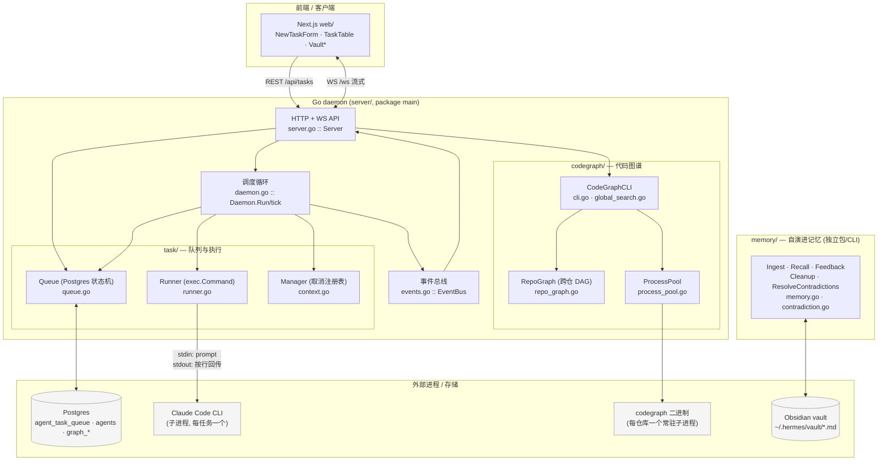
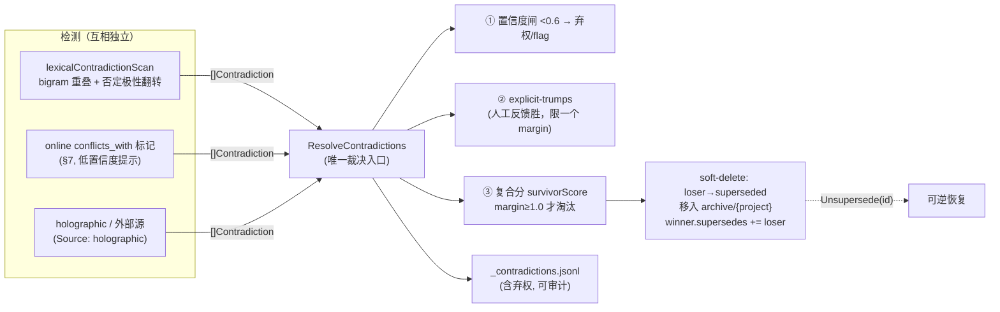

# SHRIMP — 架构设计文档

> 面向新加入者与审计者。本文描述 `ming-agents` 仓库的整体架构、模块边界、数据流，
> 并指向具体的代码路径与函数名，便于按图索骥。
>
> 版本：`0.1.0-mvp-a`（见 `server/main.go` 的 `version`）。代码以 Go daemon 为主体，
> Next.js 为前端，Postgres 为状态存储，Claude Code 为执行单元。

---

## 1. 项目定位

**SHRIMP 是一个 Postgres 支撑的任务队列调度器，把每个任务作为一个 Claude Code 子进程拉起执行，并通过 REST + WebSocket API 对外暴露。**

它解决的核心问题是：**让多个 AI agent（不同模型 / 不同并发上限）可靠地、可取消地、可观测地消费一个任务队列**，同时为这些 agent 提供两类「外脑」——跨仓代码图谱（codegraph）和自演进记忆（memory）。

四个支柱：

| 支柱 | 技术 | 角色 |
| --- | --- | --- |
| **Go daemon** | Go 1.24，标准库 `net/http` + `pgx/v5` | 调度循环、队列状态机、子进程运行器、HTTP/WS API |
| **Next.js** | `web/`（App Router + TS） | 任务提交 / 实时输出 / vault 浏览的前端 |
| **Postgres 队列** | `agent_task_queue` 表 + `FOR UPDATE SKIP LOCKED` | 任务的持久化状态机、并发 claim 的正确性根基 |
| **Claude Code** | `exec.Command` 拉起的 CLI 子进程 | 实际干活的执行单元；prompt 经 stdin 注入，输出按行流式回传 |

非目标（MVP Version A 明确不做）：不使用 terminal multiplexer（tmux 等），不做多 daemon 分布式协调（但 `SKIP LOCKED` 已为未来多 worker 预留正确性），不做鉴权。

---

## 2. 系统架构图

**三大子系统边界与数据流：**

1. **task queue（命脉）**：`web → API → Queue(Postgres) → 调度循环 claim → Runner 拉 Claude Code 子进程 → 输出经 EventBus 流回 WS`。这是请求的主干路径。
2. **codegraph（代码理解）**：按需调用，给 agent 提供「这个 repo / 这一组 repo 里某符号的调用关系」。每个仓库一个常驻 `codegraph` 子进程（ProcessPool 复用），跨仓关系存在内存 DAG `RepoGraph` 里。
3. **memory（记忆）**：目前是**独立的 Go 包 + CLI + Python 实现**，读写文件系统上的 Obsidian vault，尚未接入 HTTP daemon（见 §6 下一步）。

---

## 3. 核心模块说明

### 3.1 入口与装配 — `server/main.go`

`main()` 分发子命令（`run` / `version`）。`run()` 是装配根：
`LoadConfig` → `db.Connect` + `db.Migrate` → `agent.Registry.Sync`（把配置里的 agent upsert 进 `agents` 表）→ 建 `EventBus` / `CodeGraphCLI` / `RepoGraph` → `NewDaemon` + `NewServer` → 并发跑 `StartHTTP` 和 `daemon.Run`，靠 `signal.NotifyContext` 优雅停机（停机时等待在途任务 drain）。

### 3.2 配置 — `server/config.go`

`LoadConfig()` 全部来自环境变量，agent 列表来自可选 JSON 文件（`SHRIMP_CONFIG`，见 `config.example.json`）。关键项：`DATABASE_URL`（必填）、`SHRIMP_POLL_INTERVAL`（默认 1s）、`SHRIMP_HEARTBEAT_INTERVAL`（5s）、`SHRIMP_ORPHAN_TIMEOUT`（30s）、`SHRIMP_TASK_TIMEOUT`（30m）、`SHRIMP_CLAUDE_CMD`（`claude`）。`ClaudeArgs` 默认 `-p --model {{model}}`，`{{model}}` 在运行期替换。

### 3.3 调度循环 — `server/daemon.go :: Daemon`

- `Run(ctx)`：启动先做一次 `RecoverOrphanedTasks`，然后 `time.Ticker` 每 `PollInterval` 调一次 `tick`；`ctx` 取消时 `wg.Wait()` 等在途任务结束。
- `tick`：遍历 `Registry.All()` 的每个 agent，算 `free = MaxConcurrentTasks - inflightCount(agentID)`，对每个空闲槽 `Queue.Claim`，成功就 `addInflight` 并起一个 goroutine 跑 `execute`。**进程内 `inflight` map 是 DB claim 之上的本地并发闸**，保证一次 tick 恰好 claim 到空闲槽数量（测试见 `daemon_test.go`）。
- `execute`：`Manager.Start` 派生可取消 ctx → `MarkRunning` → 起 `heartbeat` goroutine（刷新存活 + 响应远程取消）→ 用 `TaskTimeout` 包一层 ctx → `Runner.Run`。结束后按 `err == nil / DeadlineExceeded / ctx.Err() / 其他` 四分支写终态（`Complete/Fail/Canceled`），并用一个**脱离父 ctx 的 5s detached ctx** 写终态，避免父 ctx 已取消导致最终状态写不进去。
- `heartbeat`：周期性 `Queue.Heartbeat`；若返回 `cancelRequested` 则 `Manager.Cancel(id)`（→ ctx 取消 → `Runner` 对子进程发 SIGTERM）。
- `CancelTask`：本地在途的直接 `Manager.Cancel`；否则在 DB 上置 `cancel_requested`，由属主 worker 在下次心跳响应。

### 3.4 队列状态机 — `server/task/queue.go :: Queue`

Postgres 支撑，行级锁保证并发安全。共享列表 `taskColumns` + `scanTask` 保持 SELECT 一致。关键方法：

- `Claim`：单条 `UPDATE ... WHERE id = (SELECT ... FOR UPDATE SKIP LOCKED LIMIT 1)`，按 `priority ASC, created_at ASC` 取最高优先级 pending，原子置 `claimed` 并 `attempts+1`。**`SKIP LOCKED` 是多 goroutine / 未来多 daemon 并发 claim 不重复的根基**（测试 `TestQueueConcurrentClaimNoDoubleAssign`）。空 `agentIDs` 直接返回 `ErrNoTask`，不触库。
- `Heartbeat`：刷新 `heartbeat_at`，返回 `cancel_requested`；若行已不属于本 worker / 已终态（`ErrNoRows`）则**视为取消信号**返回 `true`。
- `RecoverOrphanedTasks`：心跳超时的 `claimed/running` 任务，已达 `max_attempts` 的 → `failed`，其余 → 重置回 `pending` 可被重新 claim。
- 终态：`Complete / Fail（保留 partial result）/ Canceled`；`RequestCancel` 置标志位；`CountInflight` 供重启后重算空闲槽。

状态取值见 `task/task.go`：`pending/claimed/running/completed/failed/canceled`，外加 memory 子系统无关。优先级 `1=High … 3=Low`，claim 按 ASC。

### 3.5 子进程运行器 — `server/task/runner.go :: Runner`

`Run(ctx, spec, onChunk)`：`exec.CommandContext` 拉起 `spec.Command`，`{{model}}/{{thinking}}` 经 `substitute` 替换。**prompt 经 stdin 写入后立即关闭 stdin（EOF）**，stdout/stderr 各起一个 goroutine 按行 `bufio.Scanner` 扫描（`MaxLineBytes` 默认 1MB，防 stream-json 巨帧）。**stdout 累积进 result，stderr 只转发给 `onChunk` 不计入 result**。`onChunk` 会被两个 drain goroutine 并发调用（回调需自行同步）。取消：`cmd.Cancel` 先发 SIGTERM，`WaitDelay` 后再 SIGKILL；ctx 取消时返回 `ctx.Err()` 以区分取消与真实失败。

### 3.6 取消注册表 — `server/task/context.go :: Manager`

把每个在途任务的 `context.CancelFunc` 按 id 登记，让 HTTP API 能按 id 取消正在运行的任务（ctx 取消 → SIGTERM）。`Start` 返回派生 ctx 与 `done()`（结束时注销），`Cancel(id)` 命中返回 `true`，`Inflight()` 报当前在途数。测试见 `context_test.go`。

### 3.7 HTTP / WS — `server/server.go` + `server/events.go`

`Server.Handler()` 用 Go 1.22 的方法路由注册：`GET/POST /api/tasks`、`GET /api/tasks/{id}`、`POST /api/tasks/{id}/cancel`、`GET /api/agents`、`GET /ws`、`GET /healthz`，并挂载 `api.GraphHandler`（`/api/graph/*`）。`EventBus` 是进程内 pub/sub，订阅者 channel 满则丢帧（实时输出容忍丢失）。事件类型见 `events.go`：`task.created/claimed/running/chunk/completed/failed/canceled`。

> 注：`api.ProjectHandler`（`/api/projects`）当前在 `server.go` 中被注释掉，尚未挂载。

### 3.8 Agent 注册表 — `server/agent/agent.go :: Registry`

`Sync` 把配置里的 agent upsert 进 `agents` 表并回读 id；`Agent` 携带 `Model / ThinkingLevel / MaxConcurrentTasks / Command / Args`（每 agent 可覆盖默认 claude 命令）。`ByID/ByName/All/IDs` 供调度与 API 使用。

### 3.9 持久化 — `server/db/db.go` + `server/db/migrations/`

`Connect` 建 `pgxpool` 并 `Ping`；`Migrate` 按文件名字典序执行 `migrations/*.sql`（全部 `IF NOT EXISTS` 幂等）。迁移：`0001` 初始（agents + agent_task_queue）、`0002/0003` codegraph + repo graph、`0004` agent command/args、`0005` task max_attempts。

---

## 4. 多仓协作设计（codegraph）

代码图谱分两层，对应「仓内符号级」与「跨仓服务级」：

### 4.1 仓内：`CodeGraphCLI` + `ProcessPool`

`codegraph/cli.go` 封装对外部 `codegraph` 二进制的调用：`Status / Query / Files / GetCallers / GetCallees / Context` 等，输入是「某仓库路径 + 符号/查询」，输出是结构化的 `Node / Caller / Callee / Subgraph`。
`codegraph/process_pool.go :: ProcessPool` **按仓库绝对路径维护常驻子进程池**（`maxProcsPerRepo` + idle 超时回收），避免每次查询都冷启动一个 codegraph 进程——这是性能关键。

### 4.2 跨仓：`RepoGraph`（内存 DAG）

`codegraph/repo_graph.go :: RepoGraph` 是一张**仓库级有向图**：节点 `RepoNode` = 一个仓库，边 `RepoEdge` = 仓库间的调用/依赖关系，类型 `RepoEdgeType ∈ {http, grpc, event, db}`，带 `Endpoint`（如 `POST /api/tasks`）、`Confidence`、`DiscoveredAt`。提供 `AddNode/AddEdge/GetReachable(repos, direction, maxDepth)` 等图操作，`GetReachable` 支持上/下游可达性遍历（影响面分析）。图可 `MarshalJSON/UnmarshalJSON` 与 DB 互转（API `POST /api/graph/sync-db | persist-db`）。

### 4.3 跨仓搜索：`GlobalSearch`

`codegraph/global_search.go :: GlobalSearch(query, repoIDs)`：用 `errgroup`（并发上限 10，每仓 30s 超时）对一组仓库**并发执行同一查询**，经 `ProcessPool.resolveRepoPath` 把 repoID 解析为路径，聚合 `Results` 并**逐仓收集错误而不中断**（单仓失败不拖垮整体）。这让一个 agent 能在「一个微服务集群」范围内做符号检索，而不只在单仓内。

API 入口见 `api/graph.go :: GraphHandler.RegisterRoutes`（`/api/graph/nodes|edges|...`）。

---

## 5. Memory 子系统架构

记忆是 agent 的「自演进外脑」：给笔记打分入库（vault/notes 或 inbox）、按过滤召回、记录使用反馈、过期归档。Go 实现 `server/memory/memory.go` 与 Python `memory_api.py` 保持字段级 parity，CLI 见 `memory/cmd/memory-cli`。详细设计见 `server/memory/IMPLICIT_FEEDBACK_DESIGN.md`（§6/§7/§13）与 `server/memory/MEMORY.md`。

核心 API：`Ingest`（打分 → notes/inbox）、`Recall`（过滤 + 按 score 排序）、`Feedback`（used/helpful → 调 score + 记 `ExplicitHits`）、`Cleanup`（过期归档 + 矛盾淘汰）、`Stats`。打分维度：novelty / specificity / reusability / source。**novelty 用 char-bigram Jaccard（`bigramJaccard`，rune 级，CJK 友好）**，取代了对中文全盲的 word-set 版本。

### 5.1 §13 矛盾淘汰：检测与淘汰分离

设计要点（见 `contradiction.go`）：**多个检测器各自把矛盾归一化成 `Contradiction`，统一汇入唯一裁决入口 `ResolveContradictions`，共享一套淘汰策略与一份审计日志。** 淘汰从不在 hot path 发生。

- **`survivorScore`** = `wScore·Score + wEvidence·evidence + wRecency·recencyFactor + wHits·log1p(HitCount)`，evidence 优先（MVP 降级为 explicit-only），recency 半衰期 90 天。
- **三层裁决**：置信度 < 0.6 弃权；一方有 explicit 反馈则胜出（但落后超过一个 margin 时仍弃权，防劣质 explicit 淘汰强 memory）；否则比 `survivorScore`，差距 ≥ `evictMargin(1.0)` 才淘汰。
- **soft-delete 而非硬删**：loser 置 `status=superseded`，移入 `archive/{project}`，写 `superseded_by/at/reason`；winner 记 `supersedes`。**可审计**（`_contradictions.jsonl`，弃权也记）、**可逆**（`Unsupersede`）。
- **`ContradictionDetector` 是可注入 var**，默认纯 Go 的 `lexicalContradictionScan`；holographic 作为外部源直接喂 `ResolveContradictions`，**不**在 Go 内调用。
- `Cleanup()` 的自动裁决阶段刻意保守：**AutoEvict 关闭（只 flag 不淘汰）**，真正淘汰是显式操作（`memory-cli resolve`），首次上线先跑 `DryRun`。

字段层面，`Memory` 新增 `ConflictsWith / SupersededBy / Supersedes / SupersededAt / SupersededReason / ExplicitHits / …`，全部 `omitempty`，旧 vault 文件零值兼容。

---

## 6. 下一步计划

按优先级：

1. **Phase 3 — implicit feedback（§7）**：实现 per-turn 隐式反馈（`ImplicitHits / PendingScore / LastImplicit` 字段已在 `Memory` 预留但无逻辑）。落地后：online 检测把矛盾写入 `conflicts_with` 标记，`survivorScore` 的 `evidence()` 从 explicit-only 升级为「explicit + 通过 probation 的 implicit_hits」。详见 `IMPLICIT_FEEDBACK_DESIGN.md` §5/§7。
2. **把 memory 接入 HTTP daemon**：当前 memory 是独立包 + CLI，未挂到 `server.go`。需加 `/api/memory/*` 路由（ingest/recall/feedback/resolve），让在途 agent 能在线读写记忆，并把 codegraph stats 那样的「任务前置上下文」扩展到 memory recall。
3. **挂载已写好但未接的路由**：`api.ProjectHandler`（`/api/projects`）在 `server.go` 被注释，需补齐项目/端点/绑定的管理面。
4. **Config 重构**：`config.go` 目前是扁平 env 解析；随着子系统增多（codegraph 池参数、memory vault 路径、§7 阈值），考虑分组 + 校验 + 一份 schema 文档，并让 `MaxAttempts` 真正贯穿到 `Enqueue`（当前 DDL 默认 3）。
5. **队列集成测试常态化**：`queue_test.go` 的 DB 集成用例已就绪（`DATABASE_URL` 守卫），需在 CI 挂一个一次性 Postgres 让其常跑，而非仅本地 skip。
6. **多 daemon 水平扩展**：`SKIP LOCKED` 已保证 claim 正确性，可进一步引入 worker 心跳表与 leader-less 编排，把单 daemon 扩成多副本。

---

## 附：快速导航

| 你想看… | 去这里 |
| --- | --- |
| 进程怎么起来的 | `server/main.go :: run` |
| 任务怎么被调度的 | `server/daemon.go :: Daemon.tick / execute` |
| 队列状态机 / 并发正确性 | `server/task/queue.go :: Claim / RecoverOrphanedTasks` |
| 子进程怎么拉起、prompt 怎么注入 | `server/task/runner.go :: Runner.Run` |
| 取消信号怎么传到子进程 | `server/task/context.go` + `daemon.go :: heartbeat` |
| 跨仓代码关系 | `server/codegraph/repo_graph.go` + `global_search.go` |
| 记忆打分与召回 | `server/memory/memory.go` |
| 矛盾淘汰 | `server/memory/contradiction.go` + `IMPLICIT_FEEDBACK_DESIGN.md` §13 |
| HTTP 路由全集 | `server/server.go :: Handler` + `server/api/graph.go` |
| 数据库表结构 | `server/db/migrations/*.sql` |
