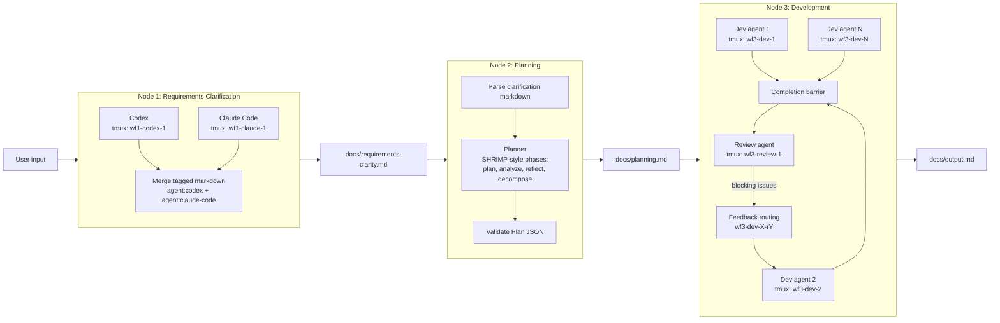

# MVP Dynamic Workflow System - Technical Design

## 1. System Overview

The MVP is a three-node workflow pipeline:

1. **Requirements Clarification**: run independent analysis agents against the same user input and persist a merged clarification contract.
2. **Planning**: convert the clarification contract into a structured execution plan with dispatchable subtasks.
3. **Development**: execute the planned subtasks in isolated agent sessions, review the resulting diffs, and route fixes back to the responsible session.

Each node is implemented as a Go orchestration function. Agents are external CLIs launched inside `tmux` sessions so that long-running work survives parent process interruptions and remains inspectable by operators. The orchestration layer owns lifecycle, state, prompt generation, result collection, and file contracts. Agents own analysis or implementation inside their assigned scope.

The pipeline contract is filesystem-only for the MVP:

| Boundary | File | Producer | Consumer | Purpose |
| --- | --- | --- | --- | --- |
| User input to Node 1 | in-memory string or `docs/input.md` | User/API | Node 1 | Raw requirements |
| Node 1 to Node 2 | `docs/requirements-clarity.md` | Requirements Clarification | Planning | Independent agent analyses and merged requirements decisions |
| Node 2 to Node 3 | `docs/planning.md` | Planning | Development | JSON execution spec plus human-readable summary |
| Node 3 output | `docs/output.md` | Development | User/API | Implementation summary, review report, failures, and final artifact links |

Within each node, orchestration can fan out to multiple agents. Between nodes, communication is intentionally narrow: one markdown file per node boundary. That keeps the MVP debuggable, avoids schema migration work, and makes every boundary reviewable in Git.

The runtime directory layout is:

```text
docs/
  requirements-clarity.md
  planning.md
  output.md
.workflow/
  runs/<run_id>/
    state.json
    node1/
      codex.out.md
      claude.out.md
      codex.exit
      claude.exit
    node3/
      dev-1.out.md
      dev-1.exit
      review.out.md
```

`docs/*.md` are stable contracts. `.workflow/runs/<run_id>/*` contains execution logs, per-agent raw outputs, and retry metadata.

## 2. Node 1: Requirements Clarification

Node 1 launches Codex and Claude Code simultaneously against the same requirements input. The agents must not communicate with each other. The goal is to surface ambiguities, assumptions, risks, acceptance criteria, and missing context from independent perspectives.

### tmux session naming

The canonical naming convention is:

```text
wf{node-number}-{agent-type}-{instance}
```

For Node 1, the concrete sessions are:

```text
wf1-codex-1
wf1-claude-1
```

The short aliases `wf1-codex` and `wf1-claude` may be accepted by CLI flags for Phase 1 compatibility, but the created tmux sessions should use the canonical names to avoid future collisions when multiple instances exist.

### Launch behavior

Each session writes stdout and stderr to a per-agent result file under `.workflow/runs/<run_id>/node1/`. The orchestrator creates a prompt file first, then asks tmux to run the CLI against that file.

Example commands generated by Go:

```bash
tmux new-session -d -s wf1-codex-1 \
  "cd /repo && codex exec \"$(cat .workflow/runs/20260622-153000/node1/codex.prompt.md)\" > .workflow/runs/20260622-153000/node1/codex.out.md 2>&1; echo $? > .workflow/runs/20260622-153000/node1/codex.exit"

tmux new-session -d -s wf1-claude-1 \
  "cd /repo && claude -p \"$(cat .workflow/runs/20260622-153000/node1/claude.prompt.md)\" > .workflow/runs/20260622-153000/node1/claude.out.md 2>&1; echo $? > .workflow/runs/20260622-153000/node1/claude.exit"
```

For production-hardening after the MVP, pass prompt paths to wrapper scripts instead of interpolating prompt content into shell strings. For the MVP skeleton, every shell argument is escaped with `exec.Command` or `strconv.Quote`.

### Prompt templates

Codex prompt:

```markdown
# Role
You are the Codex requirements clarification agent for a dynamic workflow run.

# Input Requirements
{{USER_INPUT}}

# Task
Analyze the requirements independently. Do not implement anything.

# Output Format
Return markdown with these exact headings:

## Ambiguities
- List unclear requirements and why each matters.

## Assumptions
- List concrete assumptions that would unblock planning.

## Acceptance Criteria
- List observable completion criteria.

## Risks
- List technical or process risks.

## Suggested Subtasks
- List candidate implementation subtasks with likely repo paths.
```

Claude Code prompt:

```markdown
# Role
You are the Claude Code requirements clarification agent for a dynamic workflow run.

# Input Requirements
{{USER_INPUT}}

# Task
Independently critique and clarify the requirements. Focus on missing context, dependencies, validation strategy, and edge cases. Do not modify files.

# Output Format
Return markdown with these exact headings:

## Ambiguities
## Assumptions
## Acceptance Criteria
## Risks
## Suggested Subtasks
```

### Result merge contract

The orchestrator merges raw outputs into `docs/requirements-clarity.md`. Each section is tagged with the producing agent and execution status.

```markdown
# Requirements Clarity

run_id: 20260622-153000
node: 1
state: COMPLETED
generated_at: 2026-06-22T15:30:00+08:00

## Agent Result: codex

session: wf1-codex-1
status: completed
exit_code: 0

<!-- agent:codex begin -->
## Ambiguities
- The input does not state whether implementation should stop for user confirmation.

## Assumptions
- The planner may convert unresolved questions into explicit assumptions.
<!-- agent:codex end -->

## Agent Result: claude-code

session: wf1-claude-1
status: completed
exit_code: 0

<!-- agent:claude-code begin -->
## Acceptance Criteria
- Each node writes a markdown contract with state and source metadata.

## Risks
- Shell prompt interpolation must quote user-controlled input.
<!-- agent:claude-code end -->

## Aggregated Clarifications

### Confirmed Requirements
- Requirements both agents agree are explicit or strongly implied.

### Open Questions
- Questions that should be resolved before committing to broad implementation.

### Planning Inputs
- Repo paths, constraints, acceptance criteria, and risks that Node 2 must preserve.
```

If an agent fails, its tagged section is still emitted with `status: failed`, the captured output, and the error message. Node 1 returns a non-nil error only when all clarification agents fail or the merged file cannot be written.

### Result aggregation Go pseudocode

```go
type AgentRun struct {
    AgentType string
    Session   string
    Prompt    string
    OutFile   string
    ExitFile  string
}

type AgentOutput struct {
    AgentType string
    Session   string
    Status    string
    ExitCode  int
    Output    string
    Err       error
}

func mergeClarificationOutputs(runID string, outputs []AgentOutput) string {
    var b strings.Builder
    fmt.Fprintf(&b, "# Requirements Clarity\n\n")
    fmt.Fprintf(&b, "run_id: %s\nnode: 1\nstate: %s\ngenerated_at: %s\n\n",
        runID, aggregateState(outputs), time.Now().Format(time.RFC3339))

    for _, out := range outputs {
        fmt.Fprintf(&b, "## Agent Result: %s\n\n", out.AgentType)
        fmt.Fprintf(&b, "session: %s\nstatus: %s\nexit_code: %d\n\n",
            out.Session, out.Status, out.ExitCode)
        if out.Err != nil {
            fmt.Fprintf(&b, "error: %q\n\n", out.Err.Error())
        }
        fmt.Fprintf(&b, "<!-- agent:%s begin -->\n%s\n<!-- agent:%s end -->\n\n",
            out.AgentType, strings.TrimSpace(out.Output), out.AgentType)
    }

    b.WriteString("## Aggregated Clarifications\n\n")
    b.WriteString("### Confirmed Requirements\n")
    b.WriteString("- Preserve requirements explicitly shared by both agent outputs.\n\n")
    b.WriteString("### Open Questions\n")
    b.WriteString("- Treat unresolved ambiguities as planning constraints or explicit assumptions.\n\n")
    b.WriteString("### Planning Inputs\n")
    b.WriteString("- Node 2 must convert acceptance criteria and suggested subtasks into JSON plan entries.\n")
    return b.String()
}
```

## 3. Node 2: Planning

Node 2 reads `docs/requirements-clarity.md`, extracts the tagged agent sections and aggregated clarification section, and generates `docs/planning.md`. The output file contains a human-readable summary followed by a fenced JSON plan that Node 3 can parse deterministically.

The planning node follows the SHRIMP Task Manager phase pattern at the workflow level: initialize planning, analyze requirements, reflect on the proposed solution, decompose into tasks, execute later, verify later, and complete. In this MVP, Node 2 implements the planning, analysis, reflection, and task decomposition phases; Node 3 implements execution, verification, and completion. Public SHRIMP material describes this as a structured AI task workflow with task planning, deeper analysis, reflection, task decomposition, execution, verification, and completion.

### Planning contract

`docs/planning.md` format:

````markdown
# Planning

run_id: 20260622-153000
node: 2
state: COMPLETED
source: docs/requirements-clarity.md

## Planning Summary

- Goal: implement the MVP dynamic workflow orchestrator with three persisted node contracts.
- Key assumptions: tmux, Codex CLI, and Claude Code CLI are installed on the runner host.
- Execution strategy: dispatch clarification in parallel, planning as a structured spec step, and development as N isolated tmux sessions.
- Review strategy: block final completion until a review agent checks diffs against every subtask acceptance criterion.

## Execution Plan JSON

```json
{
  "task_id": "dynamic-workflow-mvp-20260622",
  "subtasks": [
    {
      "id": "subtask-1",
      "agent_type": "codex",
      "repo_path": "server/workflow",
      "description": "Implement the workflow plan parser and validation entry point.",
      "acceptance_criteria": [
        "Planning JSON is parsed into typed Go structs",
        "Invalid missing repo_path or empty acceptance criteria returns a validation error",
        "Unit tests cover valid and invalid planning files"
      ]
    }
  ]
}
```
````

The JSON schema is intentionally small:

```go
type Plan struct {
    TaskID   string    `json:"task_id"`
    Subtasks []Subtask `json:"subtasks"`
}

type Subtask struct {
    ID                 string   `json:"id"`
    AgentType          string   `json:"agent_type"`
    RepoPath           string   `json:"repo_path"`
    Description        string   `json:"description"`
    AcceptanceCriteria []string `json:"acceptance_criteria"`
}
```

Validation rules:

- `task_id` is required and stable for the run.
- `subtasks` must contain at least one item.
- `id` must be unique within the plan.
- `agent_type` must be `codex` for Node 3 MVP execution; future values can include `claude-code`, `test-runner`, or `reviewer`.
- `repo_path` must be relative to the repository root and must not contain `..`.
- `description` must include concrete work, target files or modules, and constraints.
- `acceptance_criteria` must contain at least one observable criterion.

### Agent dispatch logic pseudocode

Node 2 does not execute subtasks. It prepares dispatch metadata for Node 3.

```go
func buildDispatchQueue(plan *Plan) ([]DispatchItem, error) {
    seen := map[string]bool{}
    queue := make([]DispatchItem, 0, len(plan.Subtasks))

    for i, st := range plan.Subtasks {
        if seen[st.ID] {
            return nil, fmt.Errorf("duplicate subtask id %q", st.ID)
        }
        seen[st.ID] = true
        if st.AgentType == "" {
            st.AgentType = "codex"
        }
        if st.AgentType != "codex" {
            return nil, fmt.Errorf("unsupported agent_type %q for MVP", st.AgentType)
        }
        if filepath.IsAbs(st.RepoPath) || strings.Contains(st.RepoPath, "..") {
            return nil, fmt.Errorf("invalid repo_path for %s: %q", st.ID, st.RepoPath)
        }
        queue = append(queue, DispatchItem{
            Subtask: st,
            Session: fmt.Sprintf("wf3-dev-%d", i+1),
            WorkDir: filepath.Join(repoRoot, st.RepoPath),
        })
    }
    return queue, nil
}
```

## 4. Node 3: Development

Node 3 executes `docs/planning.md`. It parses the fenced JSON into `Plan`, validates the plan, dispatches each subtask to an isolated tmux session, waits for all sessions to finish, then runs review. Review is a barrier step: it starts only after every dev session has completed or failed.

### Development session model

Each subtask is assigned to a tmux session:

```text
wf3-dev-1
wf3-dev-2
wf3-dev-3
```

Each dev session runs `codex exec` from the assigned `repo_path`. The prompt includes the full plan, the specific subtask, acceptance criteria, and strict instructions to stay inside the assigned scope unless a change is required to satisfy the task.

Example command:

```bash
tmux new-session -d -s wf3-dev-1 \
  "cd /repo/server/workflow && codex exec \"$(cat /repo/.workflow/runs/20260622-153000/node3/dev-1.prompt.md)\" > /repo/.workflow/runs/20260622-153000/node3/dev-1.out.md 2>&1; echo $? > /repo/.workflow/runs/20260622-153000/node3/dev-1.exit"
```

The orchestrator waits for exit files rather than relying on interactive tmux state alone. A session can remain available for inspection after its process exits.

### Development prompt template

```markdown
# Role
You are a development agent executing one assigned subtask.

# Repository Scope
Repo root: {{REPO_ROOT}}
Assigned repo_path: {{REPO_PATH}}
tmux session: {{SESSION}}

# Full Task
{{TASK_ID}}

# Assigned Subtask
{{DESCRIPTION}}

# Acceptance Criteria
{{ACCEPTANCE_CRITERIA}}

# Constraints
- Work only on files required for this subtask.
- Do not revert unrelated user or agent changes.
- Add or update focused tests when behavior changes.
- At completion, summarize changed files, tests run, and any blocked criteria.
```

### Review agent

After all dev sessions complete, Node 3 creates a diff snapshot:

```bash
git diff -- . ':!docs/output.md' > .workflow/runs/<run_id>/node3/review.diff
git status --short > .workflow/runs/<run_id>/node3/review.status
```

Then it runs a review session:

```text
wf3-review-1
```

The review agent reads:

- `docs/planning.md`
- all `node3/dev-*.out.md`
- `.workflow/runs/<run_id>/node3/review.diff`
- `.workflow/runs/<run_id>/node3/review.status`

Review output is written to `.workflow/runs/<run_id>/node3/review.out.md` and summarized in `docs/output.md`.

### Review criteria checklist

The reviewer must check:

- Plan coverage: every subtask acceptance criterion is satisfied or explicitly marked blocked.
- Scope control: changes are limited to the planned repo paths unless justified.
- Build and tests: relevant tests are added or updated and verification commands are reported.
- Regression risk: shared interfaces, migrations, adapters, and workflow contracts remain compatible.
- Error handling: failure paths are represented in code and surfaced in user-readable output.
- File contracts: `docs/requirements-clarity.md`, `docs/planning.md`, and `docs/output.md` remain parseable markdown contracts.
- Security and safety: prompts do not leak secrets, shell commands quote user-controlled input, and repo paths cannot escape the repo root.
- Operational recovery: failed subtasks include enough session, output, and exit information for retry.

### Feedback loop

If review finds issues, each issue must include a target subtask ID or session. Node 3 routes the feedback back to the specific dev session by creating a retry prompt and sending it to the same tmux session if it is still alive, or by starting a replacement session with a retry suffix.

Retry session convention:

```text
wf3-dev-2-r1
wf3-dev-2-r2
```

Feedback routing logic:

```go
func routeReviewFeedback(report *ReviewReport, results []SubtaskResult) []RetryRequest {
    bySubtask := map[string]SubtaskResult{}
    bySession := map[string]SubtaskResult{}
    for _, r := range results {
        bySubtask[r.Subtask.ID] = r
        bySession[r.Session] = r
    }

    var retries []RetryRequest
    for _, issue := range report.Issues {
        if issue.Severity == "info" {
            continue
        }
        target, ok := bySubtask[issue.SubtaskID]
        if !ok && issue.Session != "" {
            target, ok = bySession[issue.Session]
        }
        if !ok {
            target = results[0] // fallback coordinator fix for unassigned integration issue
        }
        retries = append(retries, RetryRequest{
            Subtask: target.Subtask,
            Session: target.Session,
            Feedback: issue.Description,
            AcceptanceCriteria: issue.RequiredFixes,
        })
    }
    return retries
}
```

The MVP allows one retry round in Phase 3. If issues remain after retry, Node 3 writes `state: FAILED` in `docs/output.md` and preserves all artifacts.

## 5. Key Technical Decisions

### tmux as the process boundary

All long-running agent work runs in tmux sessions named:

```text
wf{N}-{agent-type}-{instance}
```

Examples:

- `wf1-codex-1`
- `wf1-claude-1`
- `wf3-dev-2`
- `wf3-review-1`

This gives a stable operator surface:

```bash
tmux list-sessions | grep '^wf'
tmux attach -t wf3-dev-2
tmux capture-pane -t wf1-codex-1 -p
```

### Markdown contracts between nodes

Each node boundary is a single markdown file. Markdown is human-reviewable, can carry structured JSON fences, and can be diffed easily. Node 2 and Node 3 parse only explicitly delimited blocks:

- Agent blocks use `<!-- agent:<id> begin -->` and `<!-- agent:<id> end -->`.
- Plan JSON uses a fenced block after `## Execution Plan JSON`.
- Output uses fixed headings for summary, review, failures, and final status.

### Filesystem-only MVP

No database is used. Runtime state is written to `.workflow/runs/<run_id>/state.json` with atomic rename:

```go
func writeJSONAtomic(path string, v any) error {
    tmp := path + ".tmp"
    data, err := json.MarshalIndent(v, "", "  ")
    if err != nil {
        return err
    }
    if err := os.WriteFile(tmp, data, 0o644); err != nil {
        return err
    }
    return os.Rename(tmp, path)
}
```

### Error handling

If a sub-agent fails, the orchestrator marks only that task as failed and continues waiting for other agents. The node fails only when its minimum useful output cannot be produced:

- Node 1 fails if both clarification agents fail.
- Node 2 fails if `docs/requirements-clarity.md` cannot be parsed or no valid subtasks can be generated.
- Node 3 fails if all dev subtasks fail, review cannot run, or review still has blocking issues after retry.

Failed agent output is never discarded. It is written into the relevant node contract or runtime artifact with session, exit code, and captured output path.

### Node state machine

Every node uses the same state enum:

```text
PENDING -> RUNNING -> WAITING_REVIEW -> COMPLETED
                         |
                         v
                       FAILED
```

Node 1 and Node 2 normally skip `WAITING_REVIEW`; they move from `RUNNING` to `COMPLETED` or `FAILED`. Node 3 enters `WAITING_REVIEW` after all dev sessions finish and before the review agent completes.

State record:

```go
type NodeStatus string

const (
    Pending       NodeStatus = "PENDING"
    Running       NodeStatus = "RUNNING"
    WaitingReview NodeStatus = "WAITING_REVIEW"
    Completed     NodeStatus = "COMPLETED"
    Failed        NodeStatus = "FAILED"
)

type NodeState struct {
    RunID     string     `json:"run_id"`
    Node      int        `json:"node"`
    Status    NodeStatus `json:"status"`
    StartedAt time.Time  `json:"started_at"`
    UpdatedAt time.Time  `json:"updated_at"`
    Error     string     `json:"error,omitempty"`
}
```

## 6. Data Flow Diagram



## 7. Core Go Code Skeleton

The following Go pseudocode is intentionally close to compilable Go. Production code should split tmux execution, markdown parsing, and state persistence into packages.

```go
package workflowmvp

import (
    "context"
    "encoding/json"
    "errors"
    "fmt"
    "os"
    "os/exec"
    "path/filepath"
    "strconv"
    "strings"
    "time"
)

type Plan struct {
    TaskID   string    `json:"task_id"`
    Subtasks []Subtask `json:"subtasks"`
}

type Subtask struct {
    ID                 string   `json:"id"`
    AgentType          string   `json:"agent_type"`
    RepoPath           string   `json:"repo_path"`
    Description        string   `json:"description"`
    AcceptanceCriteria []string `json:"acceptance_criteria"`
}

type SubtaskResult struct {
    Subtask  Subtask
    Session  string
    OutFile  string
    ExitCode int
    Status   string
    Output   string
    Err      error
}

type ReviewReport struct {
    Passed  bool          `json:"passed"`
    Summary string        `json:"summary"`
    Issues  []ReviewIssue `json:"issues"`
}

type ReviewIssue struct {
    SubtaskID     string   `json:"subtask_id,omitempty"`
    Session       string   `json:"session,omitempty"`
    Severity      string   `json:"severity"`
    Description   string   `json:"description"`
    RequiredFixes []string `json:"required_fixes"`
}

type RetryRequest struct {
    Subtask            Subtask
    Session            string
    Feedback           string
    AcceptanceCriteria []string
}

type tmuxJob struct {
    Session  string
    WorkDir  string
    Command  string
    Args     []string
    OutFile  string
    ExitFile string
}

var repoRoot = "/repo"
```

### Node 1: RunClarification

```go
func RunClarification(ctx context.Context, input string) (string, error) {
    runID := time.Now().Format("20060102-150405")
    runDir := filepath.Join(repoRoot, ".workflow", "runs", runID, "node1")
    if err := os.MkdirAll(runDir, 0o755); err != nil {
        return "", err
    }

    agents := []struct {
        typ     string
        session string
        prompt  string
        command string
        args    []string
    }{
        {
            typ: "codex", session: "wf1-codex-1",
            prompt: renderClarificationPrompt("codex", input),
            command: "codex", args: []string{"exec"},
        },
        {
            typ: "claude-code", session: "wf1-claude-1",
            prompt: renderClarificationPrompt("claude-code", input),
            command: "claude", args: []string{"-p"},
        },
    }

    jobs := make([]AgentRun, 0, len(agents))
    for _, a := range agents {
        promptFile := filepath.Join(runDir, a.typ+".prompt.md")
        outFile := filepath.Join(runDir, a.typ+".out.md")
        exitFile := filepath.Join(runDir, a.typ+".exit")
        if err := os.WriteFile(promptFile, []byte(a.prompt), 0o644); err != nil {
            return "", err
        }

        promptArg := "$(cat " + strconv.Quote(promptFile) + ")"
        shell := fmt.Sprintf(
            "cd %s && %s %s %s > %s 2>&1; echo $? > %s",
            strconv.Quote(repoRoot),
            shellQuote(a.command),
            strings.Join(shellQuoteAll(a.args), " "),
            promptArg,
            strconv.Quote(outFile),
            strconv.Quote(exitFile),
        )
        if err := tmuxNewSession(ctx, a.session, shell); err != nil {
            return "", err
        }
        jobs = append(jobs, AgentRun{
            AgentType: a.typ,
            Session: a.session,
            Prompt: promptFile,
            OutFile: outFile,
            ExitFile: exitFile,
        })
    }

    outputs := make([]AgentOutput, 0, len(jobs))
    for _, job := range jobs {
        out := waitAgentOutput(ctx, job, 30*time.Minute)
        outputs = append(outputs, out)
    }

    merged := mergeClarificationOutputs(runID, outputs)
    target := filepath.Join(repoRoot, "docs", "requirements-clarity.md")
    if err := os.MkdirAll(filepath.Dir(target), 0o755); err != nil {
        return "", err
    }
    if err := os.WriteFile(target, []byte(merged), 0o644); err != nil {
        return "", err
    }

    if allAgentsFailed(outputs) {
        return target, fmt.Errorf("all clarification agents failed")
    }
    return target, nil
}
```

### Node 2: RunPlanning

```go
func RunPlanning(ctx context.Context, clarFile string) (*Plan, error) {
    data, err := os.ReadFile(clarFile)
    if err != nil {
        return nil, err
    }
    clar := parseClarificationMarkdown(string(data))
    if len(clar.AgentSections) == 0 {
        return nil, fmt.Errorf("no agent sections found in %s", clarFile)
    }

    planPrompt := renderPlanningPrompt(clar)
    plannerOut, err := runLocalPlanner(ctx, planPrompt)
    if err != nil {
        return nil, err
    }

    plan, err := extractPlanJSON(plannerOut)
    if err != nil {
        return nil, err
    }
    if err := validatePlan(plan); err != nil {
        return nil, err
    }

    planningMD := renderPlanningMarkdown(clarFile, plannerOut, plan)
    target := filepath.Join(repoRoot, "docs", "planning.md")
    if err := os.WriteFile(target, []byte(planningMD), 0o644); err != nil {
        return nil, err
    }
    return plan, nil
}

func validatePlan(plan *Plan) error {
    if plan.TaskID == "" {
        return errors.New("task_id is required")
    }
    if len(plan.Subtasks) == 0 {
        return errors.New("at least one subtask is required")
    }
    seen := map[string]bool{}
    for _, st := range plan.Subtasks {
        if st.ID == "" || seen[st.ID] {
            return fmt.Errorf("subtask id missing or duplicate: %q", st.ID)
        }
        seen[st.ID] = true
        if st.AgentType == "" || st.AgentType != "codex" {
            return fmt.Errorf("unsupported agent_type for %s: %q", st.ID, st.AgentType)
        }
        if st.RepoPath == "" || filepath.IsAbs(st.RepoPath) || strings.Contains(st.RepoPath, "..") {
            return fmt.Errorf("invalid repo_path for %s: %q", st.ID, st.RepoPath)
        }
        if st.Description == "" || len(st.AcceptanceCriteria) == 0 {
            return fmt.Errorf("subtask %s lacks description or acceptance criteria", st.ID)
        }
    }
    return nil
}
```

### Node 3: RunDevelopment

```go
func RunDevelopment(ctx context.Context, plan *Plan) error {
    if err := validatePlan(plan); err != nil {
        return err
    }
    runID := time.Now().Format("20060102-150405")
    runDir := filepath.Join(repoRoot, ".workflow", "runs", runID, "node3")
    if err := os.MkdirAll(runDir, 0o755); err != nil {
        return err
    }

    results := make([]SubtaskResult, 0, len(plan.Subtasks))
    for i, st := range plan.Subtasks {
        session := fmt.Sprintf("wf3-dev-%d", i+1)
        prompt := renderDevPrompt(plan, st, session)
        promptFile := filepath.Join(runDir, fmt.Sprintf("dev-%d.prompt.md", i+1))
        outFile := filepath.Join(runDir, fmt.Sprintf("dev-%d.out.md", i+1))
        exitFile := filepath.Join(runDir, fmt.Sprintf("dev-%d.exit", i+1))
        if err := os.WriteFile(promptFile, []byte(prompt), 0o644); err != nil {
            return err
        }
        workDir := filepath.Join(repoRoot, st.RepoPath)
        shell := fmt.Sprintf(
            "cd %s && codex exec \"$(cat %s)\" > %s 2>&1; echo $? > %s",
            strconv.Quote(workDir),
            strconv.Quote(promptFile),
            strconv.Quote(outFile),
            strconv.Quote(exitFile),
        )
        if err := tmuxNewSession(ctx, session, shell); err != nil {
            results = append(results, SubtaskResult{
                Subtask: st, Session: session, OutFile: outFile,
                Status: "failed", ExitCode: -1, Err: err,
            })
            continue
        }
        results = append(results, SubtaskResult{
            Subtask: st, Session: session, OutFile: outFile,
            Status: "running",
        })
    }

    for i := range results {
        if results[i].Status == "failed" {
            continue
        }
        results[i] = waitDevResult(ctx, results[i], runDir, 45*time.Minute)
    }

    report, err := RunReview(ctx, results)
    if err != nil {
        writeOutputMarkdown(plan, results, report, "FAILED", err)
        return err
    }

    if !report.Passed {
        retries := routeReviewFeedback(report, results)
        retryResults := runRetries(ctx, plan, retries, runDir)
        results = append(results, retryResults...)

        report, err = RunReview(ctx, results)
        if err != nil {
            writeOutputMarkdown(plan, results, report, "FAILED", err)
            return err
        }
    }

    if !report.Passed {
        writeOutputMarkdown(plan, results, report, "FAILED", errors.New("review failed after retry"))
        return errors.New("development review failed after retry")
    }

    return writeOutputMarkdown(plan, results, report, "COMPLETED", nil)
}
```

### Reviewer: RunReview

```go
func RunReview(ctx context.Context, results []SubtaskResult) (*ReviewReport, error) {
    runDir := inferRunDir(results)
    diffFile := filepath.Join(runDir, "review.diff")
    statusFile := filepath.Join(runDir, "review.status")
    reviewOut := filepath.Join(runDir, "review.out.md")
    reviewJSON := filepath.Join(runDir, "review.json")

    diffCmd := exec.CommandContext(ctx, "git", "diff", "--", ".", ":!docs/output.md")
    diffCmd.Dir = repoRoot
    diffData, err := diffCmd.Output()
    if err != nil {
        return nil, err
    }
    if err := os.WriteFile(diffFile, diffData, 0o644); err != nil {
        return nil, err
    }

    statusCmd := exec.CommandContext(ctx, "git", "status", "--short")
    statusCmd.Dir = repoRoot
    statusData, err := statusCmd.Output()
    if err != nil {
        return nil, err
    }
    if err := os.WriteFile(statusFile, statusData, 0o644); err != nil {
        return nil, err
    }

    prompt := renderReviewPrompt(results, diffFile, statusFile)
    promptFile := filepath.Join(runDir, "review.prompt.md")
    exitFile := filepath.Join(runDir, "review.exit")
    if err := os.WriteFile(promptFile, []byte(prompt), 0o644); err != nil {
        return nil, err
    }

    shell := fmt.Sprintf(
        "cd %s && codex exec \"$(cat %s)\" > %s 2>&1; echo $? > %s",
        strconv.Quote(repoRoot),
        strconv.Quote(promptFile),
        strconv.Quote(reviewOut),
        strconv.Quote(exitFile),
    )
    if err := tmuxNewSession(ctx, "wf3-review-1", shell); err != nil {
        return nil, err
    }

    job := AgentRun{
        AgentType: "reviewer",
        Session: "wf3-review-1",
        Prompt: promptFile,
        OutFile: reviewOut,
        ExitFile: exitFile,
    }
    out := waitAgentOutput(ctx, job, 30*time.Minute)
    if out.Err != nil {
        return nil, out.Err
    }

    report, err := parseReviewReport(out.Output)
    if err != nil {
        return nil, err
    }
    data, _ := json.MarshalIndent(report, "", "  ")
    _ = os.WriteFile(reviewJSON, data, 0o644)
    return report, nil
}
```

### Shared tmux helpers

```go
func tmuxNewSession(ctx context.Context, session, shell string) error {
    _ = exec.CommandContext(ctx, "tmux", "kill-session", "-t", session).Run()
    cmd := exec.CommandContext(ctx, "tmux", "new-session", "-d", "-s", session, shell)
    return cmd.Run()
}

func waitAgentOutput(ctx context.Context, job AgentRun, timeout time.Duration) AgentOutput {
    deadline := time.After(timeout)
    tick := time.NewTicker(2 * time.Second)
    defer tick.Stop()

    for {
        select {
        case <-ctx.Done():
            return AgentOutput{AgentType: job.AgentType, Session: job.Session, Status: "failed", ExitCode: -1, Err: ctx.Err()}
        case <-deadline:
            return AgentOutput{AgentType: job.AgentType, Session: job.Session, Status: "failed", ExitCode: -1, Err: errors.New("agent timeout")}
        case <-tick.C:
            if _, err := os.Stat(job.ExitFile); err == nil {
                outputBytes, _ := os.ReadFile(job.OutFile)
                exitBytes, _ := os.ReadFile(job.ExitFile)
                exitCode, _ := strconv.Atoi(strings.TrimSpace(string(exitBytes)))
                status := "completed"
                var runErr error
                if exitCode != 0 {
                    status = "failed"
                    runErr = fmt.Errorf("agent exited with code %d", exitCode)
                }
                return AgentOutput{
                    AgentType: job.AgentType,
                    Session: job.Session,
                    Status: status,
                    ExitCode: exitCode,
                    Output: string(outputBytes),
                    Err: runErr,
                }
            }
        }
    }
}
```

## 8. Implementation Phases

### Phase 0: Hardcoded 3-node chain, sequential, single agent per node

Build the smallest end-to-end path:

- `RunClarification` invokes one Codex process without tmux fanout.
- `RunPlanning` reads `docs/requirements-clarity.md` and writes a hand-validated `docs/planning.md`.
- `RunDevelopment` executes one subtask with `codex exec`.
- `docs/output.md` is written with status, changed files, and known failures.
- State is persisted to `.workflow/runs/<run_id>/state.json`.

Exit criteria:

- A sample input produces all three markdown contracts.
- A failed agent writes captured output and marks the node failed.
- The chain can be rerun without deleting prior run artifacts.

### Phase 1: Node 1 runs Codex + Claude Code in parallel

Add tmux-backed parallel clarification:

- Create canonical sessions `wf1-codex-1` and `wf1-claude-1`.
- Write per-agent prompt, output, and exit files.
- Wait for both exit files.
- Merge tagged sections into `docs/requirements-clarity.md`.
- Continue if one agent fails; fail only if both fail.

Exit criteria:

- Both tmux sessions launch within the same orchestration step.
- The merged markdown includes both agent identifiers and statuses.
- Operator can inspect sessions with `tmux attach -t <session>`.

### Phase 2: Node 3 dispatches to N dev sessions based on spec

Implement dynamic subtask dispatch:

- Parse `docs/planning.md` fenced JSON into `Plan`.
- Validate `task_id`, unique subtask IDs, `agent_type`, `repo_path`, and acceptance criteria.
- Start `wf3-dev-1` through `wf3-dev-N`.
- Run each `codex exec` from its assigned repo path.
- Continue other subtasks when one subtask fails.
- Collect `SubtaskResult` values and write them to `docs/output.md`.

Exit criteria:

- A plan with three subtasks launches three isolated tmux sessions.
- Failed subtasks are visible in output without cancelling successful subtasks.
- Output includes session names, exit codes, and raw artifact paths.

### Phase 3: Review loop with retry, error recovery, state persistence

Add the quality gate:

- After all dev sessions finish, write `review.diff` and `review.status`.
- Start `wf3-review-1`.
- Parse the review report into `ReviewReport`.
- Route blocking issues to the matching subtask session or retry session.
- Allow one retry round for MVP.
- Persist node state transitions: `PENDING`, `RUNNING`, `WAITING_REVIEW`, `COMPLETED`, `FAILED`.

Exit criteria:

- Review never starts before all initial dev sessions finish.
- Review issues include target `subtask_id` or `session`.
- Retry prompts include original acceptance criteria plus review feedback.
- Remaining blocking review issues mark `docs/output.md` as failed with actionable detail.
