# 【技术评审】shrimp-graph orchestrator

> 状态：草稿 v0.1 ｜ 受众：评审委员会 ｜ 配套 runbook：`SKILL.md`
>
> 本文档是 shrimp-graph 的**人类技术评审文档**，与 `SKILL.md`（LLM / runner 操作 runbook）配套但分工不同。本文走火山技术评审模版 17 章节 + 5 张 whiteboard 图。

---

## 1. 版本记录表

| 版本 | 日期 | 修改人 | 修改内容 | 评审状态 |
|---|---|---|---|---|
| v0.1 | 2026-05-13 | (author) | 初稿：基于 SKILL.md / graph.py / state.py / graph_cli.py 现状汇总，17 章节骨架 + 起手内容 | 待评审 |
| v0.2 | TBD | — | 评审反馈 + whiteboard 图补全 | 待评审 |
| v1.0 | TBD | — | 评审通过 | 已发布 |

注：SKILL.md 早期演进可参考 `SKILL.md.bak.1` .. `.bak.50` 50 份历史备份的 mtime / hash 反推。

---

## 2. 背景

### 2.1 待解决的问题

shrimp graph orchestrator 在 2026-Q2 之前用纯人工方式驱动 PM/PLAN/DEV/REV 四阶段研发流程，暴露以下问题：

1. **HITL 控制粒度过粗**：每个阶段都让人审批 → 体验差；不审批 → 看不到进度 → 体验也差。需要"审批稀疏 + 感知密集"的二元化。

2. **subagent 输入飘移**：多次 dispatch 过程中，中间 LLM（Hermes / cc-lead）可能不自觉地"摘要" subagent 输出 → 改写 handoff_note、合并 open_issues、漏 quote reasons，导致下游 subagent 拿到失真上下文。一次飘移会沿 PM→PLAN→DEV→REV 链路放大。

3. **subagent 自我矛盾**：无机制约束 subagent 返回结构合法性，如 status 跟 gate_result.passed 矛盾、声明 artifact 但不真落盘、handoff_note 缺失等，直接信任会丢可恢复性。

4. **cc-lead 死锁**：subagent 跑代码时若遇到需要 sudo / push 到 main 等敏感操作，cc-lead 默认行为是弹审批等用户回复 → 但 workflow 是无人值守模式 → 永远等下去。

5. **rollback 后历史丢失**：研发流程必然多轮 rollback。如果不显式控制 state 拷贝，rollback 后看不到上一轮做了什么，等于"白做"。

6. **audit 不可重放**：研发流程要可审计——给定一个 workflow_id 和 result_file，要能复现每一步的输入输出。手工跑没这个能力。

### 2.2 目标用户

- **Hermes**：LLM-driven coordinator，加载 SKILL.md 后驱动整套流程
- **runner**：实际跑 cc-lead 的进程
- **用户**：在 4 个 Gate 处拍板的人类

### 2.3 不在范围

- LLM 内部如何思考、cc-lead 的 sandbox 实现细节、飞书 IM API 本身的能力
- 火山引擎部署（见 §8，列为 future work）

---

## 3. 方案概述

### 3.1 核心架构

基于 LangGraph 的**有限状态机 + dynamic interrupt** orchestrator，通过 SQLite checkpoint 实现可恢复 workflow，通过 sha-pinning 实现 audit trail，通过 Anti-Drop Guard 实现输入飘移防御。

### 3.2 状态机骨架

11 stage + 4 gate + 7 dispatch node：

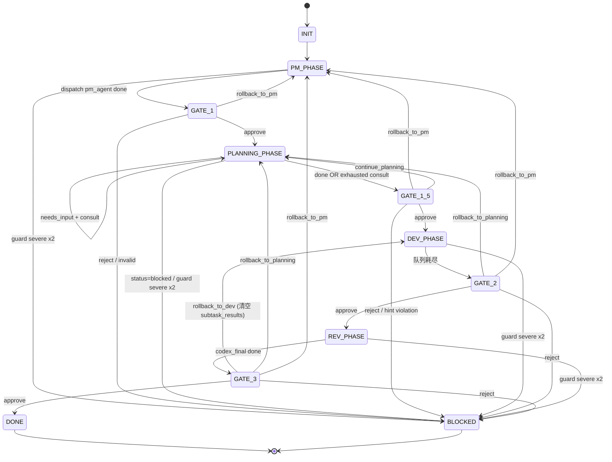

> 飞书画板（交互版）：[链接@v941a271](TODO) — **TODO**：需要人工先在 DESIGN.md 飞书 docx 里 `/插入 → 画板` 占位拿到 `whiteboard-token`，再执行 `lark-cli whiteboard +update --whiteboard-token <token> --input_format mermaid --source @data/design-lark-chart/state-machine.mmd` 填充内容，并把 token/url 回填到 `data/design-lark-chart/whiteboard-urls.json` 的 `state-machine-3.2` 条目（当前 status=pending）。本地 StaticCheck 已 PASS（nodeCount=42, connectorCount=29, errors=0, warnings=0）。

其中：
- PLANNING_PHASE 内部有 planner ↔ dev_agent 咨询循环（planning_dev_consult 子节点，上限 3 轮）
- DEV_PHASE 内部按 planner 给的 subtask_plan 迭代（dev_loop_router / dev_subtask_dispatch / dev_codex_review 3 个子节点）
- REV_PHASE 两段串行（rev_agent → codex_final）

### 3.3 关键设计选择

| 设计点 | 选择 | 理由 |
|---|---|---|
| LLM 调用 | 图本身不调 LLM，全靠 dynamic interrupt 外包 | LangGraph 节点只做路由+校验，LLM 决策外包给 runner 跑 cc-lead → 解耦，可重放 |
| 用户交互 | 5 个 CLI 命令（start/advance/status/resume/dump），所有输入走文件 | 杜绝命令行 inline 用户文本，统一 sha-pinning |
| 输入飘移防御 | Anti-Drop Guard 6 个检查 + severe 一次带 hint 重试 | 中间 LLM 不能偷改 subagent 输出 |
| 审批边界 | 4 个 Gate（gate_decision_needed interrupt） | 审批稀疏，感知密集 |
| cc-lead 防卡死 | permission_policy 必有 `ask_user=[]` + `default_action ∈ {allow_silent, deny}` | 启动期硬拒 ask_user |
| 状态持久化 | SqliteSaver 单 DB 多 workflow，以 workflow_id 作 thread_id | 简单可恢复，不增运维成本 |
| Artifact 保真 | sha-pinning + orch 自己算 sha（不信 subagent 声明） | subagent 偷改 sha 时 ground truth 仍准 |
| Verbatim 原则 | handoff_note / reasons / phase_summary 全程逐字 quote | 防中间 LLM 摘要 |

### 3.4 输出

- `state.db`（SqliteSaver，所有 workflow 共享）
- `scripts/results/<wid>/<cmd>-<ts>.json`（每次命令的完整 state 快照）
- `scripts/workflows/<wid>/artifacts/{pm,plan,dev,rev}/*`（per-stage 落盘产物）

---

## 4. 详细方案

### 4.1 关键术语

| 术语 | 定义 |
|---|---|
| **orch** | shrimp graph orchestrator,即 `graph.py` 实现的 LangGraph 状态机。负责状态路由、Anti-Drop Guard、Artifact 反验、checkpoint 持久化协调 |
| **Hermes** | LLM-driven coordinator,加载本 skill 后驱动 graph_cli 5 命令 + 飞书 IM 同步 + 在 Gate 处呈现 options 给用户 |
| **runner** | 外部进程,负责把 orch 抛出的 `subagent_dispatch` interrupt 接住,渲染 cc-lead 的 settings.json,sessions_spawn cc-lead,收 stage-result 写回 decision-file |
| **cc-lead** | Claude Code 子 agent runtime,subagent 实际跑代码的载体(可执行 Write / Edit / Bash 等工具,受 permission_policy 约束) |
| **subagent** | 在 cc-lead 上跑特定角色契约的逻辑实体。7 种:pm_agent / planner(复用 pm_agent SKILL.md)/ dev_agent / dev_agent[consult] / codex_reviewer / rev_agent / codex_final(复用 codex_reviewer SKILL.md) |
| **dispatch** | orch 通过 `subagent_dispatch` interrupt 把任务外包给 runner 的过程。dispatch 节点共 7 个 |
| **interrupt** | LangGraph dynamic interrupt 机制。本图有两种:`subagent_dispatch`(让 runner 跑 subagent)和 `gate_decision_needed`(让用户拍 gate) |
| **gate** | 用户决策点。共 4 个:Gate 1(PM 后) / Gate 1.5(PLAN 后,含 continue_planning) / Gate 2(DEV 后) / Gate 3(REV 后) |
| **stage** | workflow 的状态字段值。共 11 种 enum:INIT / PM_PHASE / GATE_1 / PLANNING_PHASE / GATE_1_5 / DEV_PHASE / GATE_2 / REV_PHASE / GATE_3 / DONE / BLOCKED |
| **checkpoint** | LangGraph 在 SqliteSaver 里持久化的 state 快照,以 thread_id (=workflow_id) 作索引。多个 workflow 共享 `state.db` 文件 |
| **artifact** | 落盘文件(如 pm_spec.md / plan.md / dev_summary.md),subagent 写,orch sha256 反验后存 `state.artifacts[key]`。**只信 orch 自己算的 sha 作 ground truth** |
| **decision-file** | 用户 / runner 通过 `resume --decision-file` 传给 orch 的 JSON 文件。两种用途:(a) subagent stage-result/v1 (subagent_dispatch 回应);(b) `{decision_id, answer, reason?}` (gate_decision_needed 回应) |
| **stage-result/v1** | subagent dispatch 返回 JSON 的 schema 标识。字段:`status` / `phase_summary` / `gate_result` / `artifact_updates` / `decision_id` |
| **handoff_note** | `phase_summary` 里的单行字符串,**G6 强制规范**:非空 + 单行 + ≤280 字符。给下游 subagent / 用户 / Hermes IM 看的人话总结 |
| **PhaseSummary** | pydantic 模型(`decisions[]` / `open_issues[]` / `risks[]` / `handoff_note`),orch 整段原样落盘到 `state.phase_summaries[stage]`,**禁止二次摘要** |
| **GateResult** | pydantic 模型(`name` / `passed` / `reasons[]`),代表 subagent 的 gate 自我声明,**不是**用户的终批准。落盘到 `state.gate_results[gate_name]` |
| **Anti-Drop Guard** | 6 项结构强校验(G1/G3/G4/G5_DECL/G5_PROVE/G6),防 subagent 输入飘移。G1/G3/G5_PROVE-file-missing 严重 → 一次带 hint 重试;其他轻微 |
| **MsgRef** | 用户消息引用(`msg_id` / `sha256` / `received_at` / `text_path` / `byte_length` / `char_length`),**正文不进 state**。raw_requirement 与 continue_planning hint 都用这个结构 |
| **synthetic-aggregate** | orch 合成的字段(非 verbatim subagent 输出)。只两处:`phase_summaries["DEV_PHASE"]`(handoff_note 以 `DEV done (synthetic);` 开头) 和 `gate_results["Gate 2"]`(N codex reviewer 没法产单一 gate_result,orch 聚合) |

### 4.2 架构设计

#### 🎨 图 1：组件分层架构图（6 swimlane）

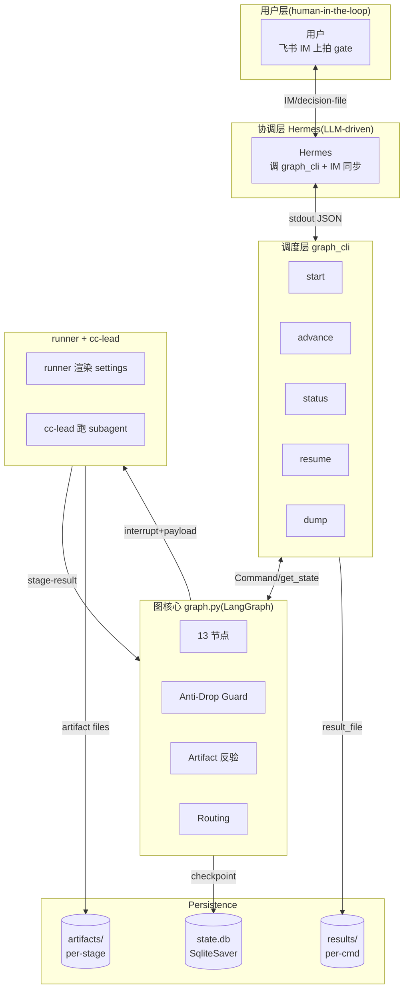

text fallback:

```
┌─────────────────────────────────────────────────────────────┐
│  用户层(human-in-the-loop)                                  │
│  ├ 飞书 IM(收 Hermes 同步,出 gate decision-file)            │
│  └ 只在 4 个 gate 上拍板                                     │
└─────────────────────────────────────────────────────────────┘
                       ▲
                       │ ⚠️/✅/🚀 IM(per dispatch),🔔 gate options
                       │ decision-file(verbatim sha-pinned)
                       ▼
┌─────────────────────────────────────────────────────────────┐
│  协调层 Hermes(LLM-driven, 加载本 SKILL.md)                 │
│  ├ 发 IM 同步 cc-lead 状态(进出 + blocker)                 │
│  ├ 调 graph_cli 5 命令                                       │
│  └ 在 gate 节点逐字呈现 options + question_text + ...       │
└─────────────────────────────────────────────────────────────┘
                       ▲
                       │ JSON stdout 摘要 + result_file 路径
                       ▼
┌─────────────────────────────────────────────────────────────┐
│  调度层 graph_cli(CLI 入口,守 size cap + UTF-8)             │
│  ├ start: 创建 wf,写 user_msgs[0],seed policy/artifacts    │
│  ├ resume: 校验 decision-file → 注入 _decision_file_*        │
│  ├ status: 只读 checkpoint                                   │
│  ├ advance: idempotent no-op when at interrupt              │
│  └ dump: 透传 result_file                                    │
└─────────────────────────────────────────────────────────────┘
                       ▲
                       │ Command(resume payload) / get_state
                       ▼
┌─────────────────────────────────────────────────────────────┐
│  图核心 graph.py(LangGraph StateGraph)                       │
│  ├ 13 节点                                                   │
│  ├ 7 个 dispatch interrupt                                   │
│  ├ 4 个 gate interrupt                                       │
│  ├ Anti-Drop Guard(G1/G3/G4/G5_DECL/G5_PROVE/G6)            │
│  ├ Artifact 反验(sha256 ground truth)                        │
│  └ Routing(_route_after_*)                                  │
└─────────────────────────────────────────────────────────────┘
                       ▲           ▲
                       │           │ subagent_dispatch interrupt + payload
                       │           ▼
                       │   ┌─────────────────────────────────────┐
                       │   │ runner(外部进程,Hermes 实施)       │
                       │   │ ├ 解析 permission_policy → 渲染     │
                       │   │ │   cc-lead settings.json           │
                       │   │ ├ sessions_spawn cc-lead             │
                       │   │ ├ cc-lead 执行 subagent SKILL        │
                       │   │ └ 收 stage-result → 写 file         │
                       │   └─────────────────────────────────────┘
                       │
                       ▼
              ┌────────────────────────┐
              │ Persistence            │
              │ ├ SqliteSaver state.db │
              │ │  (thread_id=wf_id)   │
              │ ├ artifacts/<stage>/   │
              │ └ results/<wid>/       │
              └────────────────────────┘
```

whiteboard 化要点:6 swimlane,箭头标数据类型(IM / JSON / interrupt payload / Command),颜色区分同步(实线)vs 异步(虚线)。

#### 🎨 图 5：责任分工矩阵 R&R 表（14 行为 × 6 actor）

| 行为 | 用户 | Hermes | runner | graph(orch) | cc-lead | SqliteSaver |
|---|:-:|:-:|:-:|:-:|:-:|:-:|
| 写 raw_requirement | ✓ |  |  |  |  |  |
| 调 graph_cli 5 命令 |  | ✓ |  |  |  |  |
| 飞书 IM 同步 |  | ✓ |  |  |  |  |
| 渲染 cc-lead settings |  |  | ✓ |  |  |  |
| sessions_spawn |  |  | ✓ |  |  |  |
| 跑 subagent 代码 |  |  |  |  | ✓ |  |
| 算 subagent stage-result sha |  |  | ✓(回传) |  |  |  |
| 校 decision-file size/UTF-8 |  |  |  | ✓(cli 层) |  |  |
| 状态机路由 |  |  |  | ✓ |  |  |
| Anti-Drop Guard 6 检查 |  |  |  | ✓ |  |  |
| Artifact sha 反验 |  |  |  | ✓ |  |  |
| 拍 gate decision | ✓ |  |  |  |  |  |
| Checkpoint 持久化 |  |  |  | ✓(调用) |  | ✓(执行) |
| result_file 写盘 |  |  |  | ✓(cli 层) |  |  |

### 4.3 流程设计

#### 🎨 图 2：数据流图(Mermaid)

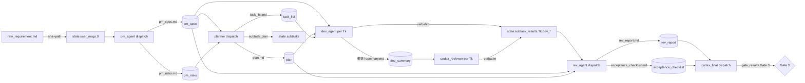

text fallback:

```
PM_PHASE ──pm_agent── pm_spec.md, pm_risks.md ──┐
                                                 │
PLANNING_PHASE ──planner── plan.md, task_list.md │ 三个 artifact + 三个 phase_summary 汇入 REV
              │                                 │
              ├ status=needs_input + question   │
              │  ↓ planning_dev_consult          │
              │  (≤3 轮,每轮 sha-pin)            │
              └─ subtask_plan ──→ state.subtasks│
                                                 │
DEV_PHASE per Tk:                                │
  dev_agent(Tk)──→ dev/summary.md(覆盖!)        │
                  → verbatim → state.subtask_results[Tk].dev_handoff_note
  codex_reviewer(Tk)──→ → verbatim → state.subtask_results[Tk].codex_*
  loop until 队列耗尽 → 合成 phase_summary[DEV] │
                                                 │
REV_PHASE:                                        │
  rev_agent ──→ rev_report.md, acceptance_*.md  │◄┘
  codex_final ──→ Gate 3 信号
```

whiteboard 化要点:节点用圆角矩形 + 颜色区分 dispatch vs gate,每条 artifact 标谁写/谁读,突出 last-write-wins(DEV)vs append-only(state.subtask_results)。

#### 🎨 图 3：细化状态机图(transition condition 标签)

每条 transition 显式条件标签,以 PLANNING_PHASE 为例:

```
PLANNING_PHASE
  ├ status=done & 5 Anti-Drop Guards 全过       → GATE_1_5
  ├ status=needs_input & dev_consultation!=null
  │   & round<3                                  → planning_dev_consult → 回 PLANNING_PHASE
  ├ status=needs_input & (dev_consultation=null
  │   OR round>=3)                               → GATE_1_5 + PLANNING_CONSULT_LIMIT minor
  ├ status=blocked                              → BLOCKED + planning-blocked-by-planner note
  └ guard severe(after 1 retry)                 → BLOCKED + guard-blocked note
```

PM/DEV/REV 类似,以"主路径"+ "rollback 路径" + "blocked 路径" 三色区分。

#### 🎨 图 4：Anti-Drop Guard 检查流图(判定树)

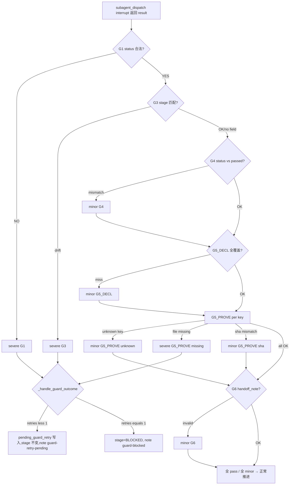

text fallback:

```
subagent_dispatch interrupt 返回 result
  ↓
[G1] result.status ∈ {done, blocked, needs_input}?
  ├ NO  → severe finding
  ↓ YES
[G3] result.stage(若有)== current_stage?
  ├ NO  → severe finding
  ↓ YES
[G4] status=done ⟹ passed=true? passed=false ⟹ status ∈ {blocked, needs_input}?
  ├ NO  → minor finding(注:codex 预期触发)
  ↓ YES/SKIP
[G5_DECL] expected_artifacts ⊆ artifact_updates.keys?
  ├ NO  → minor finding
  ↓ YES
[G5_PROVE] for k in artifact_updates:
  ├ artifact_paths[k] 不在?       → minor (未知 key)
  ├ 文件不存在?                    → **severe** finding
  ├ orch sha ≠ subagent sha?       → minor finding
  ↓ all OK
[G6] phase_summary 存在 + handoff_note 非空 + 单行 + ≤280?
  ├ NO  → minor finding
  ↓ YES
聚合 findings → _handle_guard_outcome
  ├ severe & retries<1  → 写 pending_guard_retry, stage 不变, append note "guard-retry-pending"
  ├ severe & retries>=1 → stage=BLOCKED, append note "guard-blocked"
  └ all minor / all pass → 正常推进
```

Mermaid 渲染示例(片段):
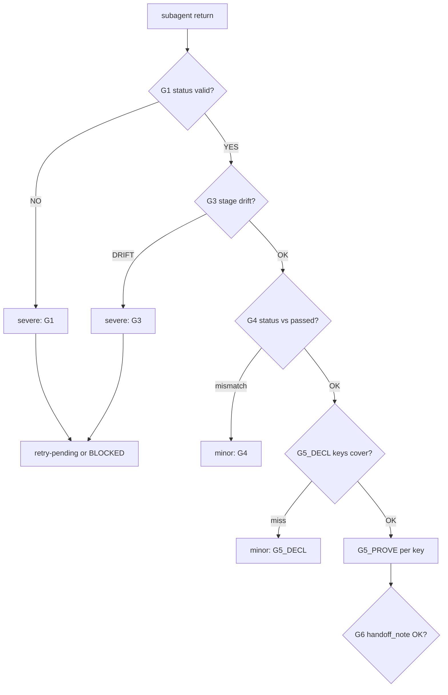

### 4.4 并发 Case 讨论

#### C-1: 同一 workflow_id 并发 `resume`

**场景**:用户/runner 误操作同时对同一 wf_id 调两次 resume。
**SqliteSaver 行为**:文件级 lock,后写覆盖前写。两次 graph.invoke 各基于自己开始时刻的快照决策 → state 不一致。
**风险**:HIGH(R-01),状态飘移。
**mitigation**:
- doc(已):严格规则"同一 wf_id 同时只能一次未完成 resume"
- code(M3):fcntl.flock 保护

#### C-2: 用户在 dispatch 期间调 `status`

**场景**:runner 跑 cc-lead 处理 dispatch interrupt,用户想看进度。
**行为**:`status` 仅读 checkpoint,看到 `stage=PM_PHASE` + `pending_interrupt.payload.type=subagent_dispatch`。SQLite 多 reader 并发 OK。
**评级**:✅ 合法用法,正常轮询。

#### C-3: cc-lead 跑期间用户**取消** workflow

**场景**:dispatch 拉太久,用户想 abort。
**现状**:**无 cancel 机制**。用户只能等 dispatch 自然结束 → reject,或 kill runner → checkpoint 停在 interrupt → workflow 永远卡。
**风险**:MED(R-16)。
**mitigation**:M3 加 `force_block --workflow-id <wf> --reason <text>`。

#### C-4: 多 workflow 并发（不同 wf_id）

**场景**:Hermes 同时推进 wf_A(GATE_1)和 wf_B(DEV_PHASE)。
**行为**:thread_id=wf_id,LangGraph checkpoint 按 thread_id 隔离。SQLite 文件级 lock 短暂排队,语义独立。
**评级**:✅ 完全隔离。

#### C-5: dispatch interrupt 期间 SqliteSaver 写失败

**场景**:磁盘满 / 文件系统 ro / SQLite lock 超时 / 进程崩。
**行为**:SqliteSaver `with ... as cp` 退出时 commit。中途崩 → 之前 checkpoint 完好(SQLite 不会半提交)→ 当前推进丢失,workflow 卡在上次 interrupt。
**恢复**:`resume` 同一 wf_id + 正确 decision-file → 重新 graph.invoke → 重新进 dispatch interrupt。LangGraph 是幂等的,安全。
**评级**:✅ Crash-safe by design。

#### C-6: dev_loop_router 内的 subtask 顺序假设

**场景**:DEV 阶段按 `state.subtasks[i]` 依次推进,用户能否"插队"加 subtask?
**行为**:`state.subtasks` 在 planner 返回时一次性写入,DEV 期间不变。插队需 rollback_to_planning。
**评级**:✅ no race。

#### C-7: Anti-Drop Guard retry 期间 `status` 返回

**场景**:首次 severe failure 写 `pending_guard_retry`,workflow 退回同一 dispatch 节点。用户在 retry pending 阶段调 status。
**行为**:
- `state.stage` 保持不变
- `state.pending_guard_retry` 非空 `{stage, subagent, attempt, findings}`
- `pending_interrupt.payload.type=subagent_dispatch`,带 `guard_failure_hint`
- `state.stage_log` 末位 note `guard-retry-pending:<subagent>:[<ids>] attempt=1/1`

**风险**:MED(R-08)— Hermes/用户容易误读为 BLOCKED。
**mitigation**:doc(SKILL.md 验证表 state.pending_guard_retry 行)+ stage_log note 词汇表。

#### C-8: PLANNING_DEV_CONSULT 期间 Hermes 看 stage

**场景**:planner 报 needs_input + dev_consultation,orch 路由到 planning_dev_consult 子节点 dispatch dev_agent。期间 Hermes 调 status。
**行为**:`state.stage=PLANNING_PHASE`(子节点不进新 stage),`pending_interrupt.payload.subagent=dev_agent`,`input_payload.consultation_mode=True`。
**评级**:✅ 已 doc 化(SKILL.md PM-Dev 协商章节"stage 字段标注语义")。Hermes 在 IM 应加 `(consultation_mode=true)` 标记。

#### 时序图模板(whiteboard 化)

每 case 一张 Mermaid sequence,以 C-1 为示例:

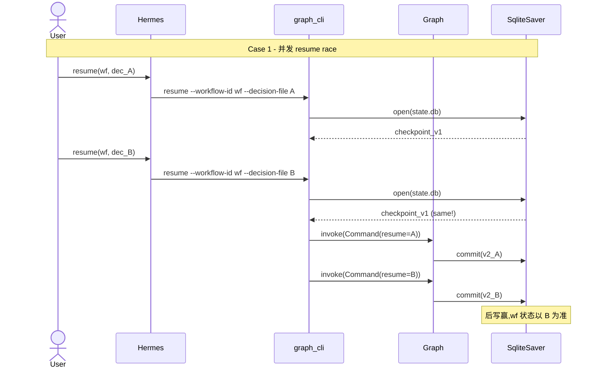

C-3 / C-4 / C-6 偏向"是否合法"判定,可不画时序图。下面补 C-2 / C-5 / C-7 / C-8 时序:

##### C-2 时序: dispatch 期间 status

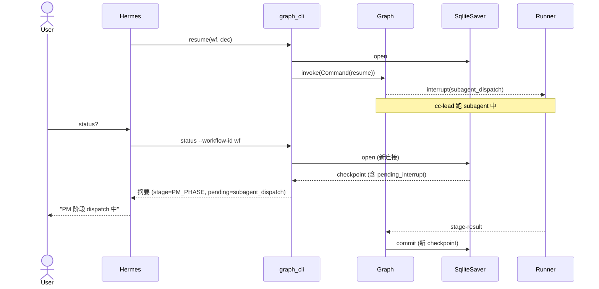

合法 ✅,SQLite 多 reader 并发 OK,语义独立。

##### C-5 时序: SqliteSaver 写失败

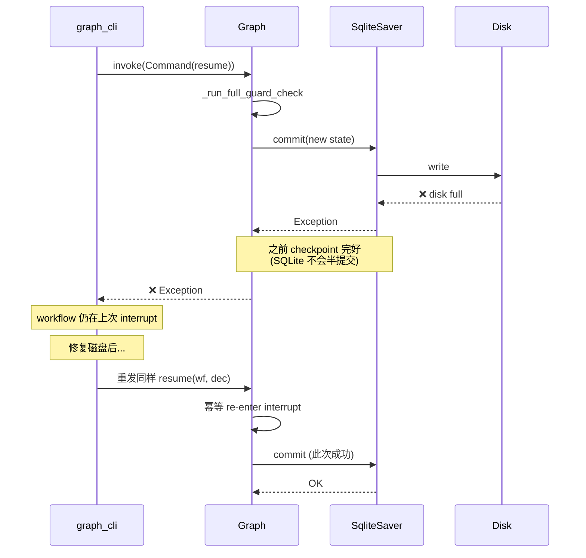

Crash-safe ✅,幂等重发是 recovery 路径。

##### C-7 时序: Anti-Drop Guard retry 期间 status

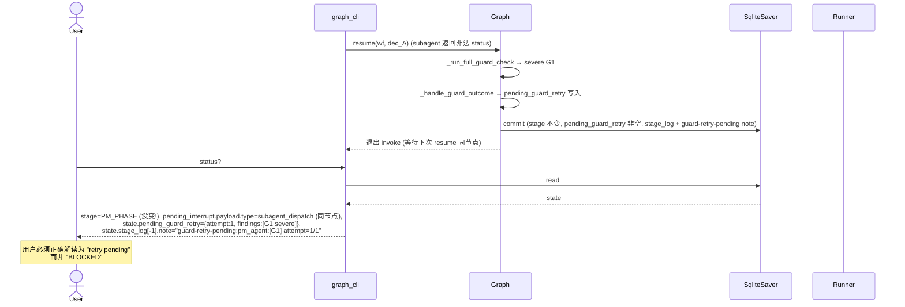

易误判 ⚠️,doc + stage_log note 是缓解。

##### C-8 时序: PLANNING_DEV_CONSULT 期间 status

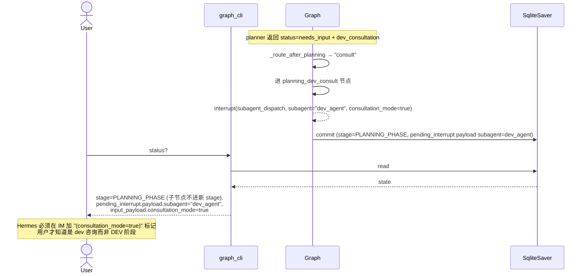

已 doc 化(SKILL.md PM-Dev 协商章节"stage 字段标注语义")。

#### 评审 takeaways

- **已 safe**(✅):C-2 / C-4 / C-5 / C-6 / C-8 —— 行为正确,只需文档化
- **已知 race**(⚠️):C-1 —— SQLite 无 application-layer mutex,建议 doc 标记 + M3 加 advisory lock
- **缺失能力**(❌):C-3 —— 无 cancel 命令,M3 实现 force_block
- **易误判**(⚠️):C-7 —— retry 路径 stage 不变,doc 强调

---

## 5. 接口定义

### 5.1 CLI 命令

| 命令 | required flags | optional flags | 输入约束 | 输出 |
|---|---|---|---|---|
| `start` | — | `--workflow-id` / `--input-file` / `--policies-file` | input-file ≤256 KiB + UTF-8;policies-file ≤64 KiB + UTF-8 + JSON object | stdout JSON 摘要 + result_file |
| `advance` | `--workflow-id` | — | — | 摘要(在 interrupt 时 idempotent no-op) |
| `status` | `--workflow-id` | — | — | 摘要(只读 checkpoint,不推进) |
| `resume` | `--workflow-id` / `--decision-file` | — | decision-file ≤256 KiB + UTF-8 + JSON object | 摘要 + result_file |
| `dump` | `--result-file` | — | — | 透传 result_file 内容,无加工 |

### 5.2 stdout 摘要 schema

```json
{
  "command": "start|advance|status|resume",
  "workflow_id": "wf-...",
  "result_file": "/abs/path/to/results/.../*.json",
  "stage": "PM_PHASE",
  "next": ["pm_phase"],
  "user_msg_sha256s": ["..."],
  "decision_sha256s": ["..."],
  "stage_log_entries": ["INIT", "PM_PHASE", ...],
  "pending_interrupt": {
    "node": "pm_phase",
    "payload": {
      "type": "subagent_dispatch" | "gate_decision_needed",
      "..."
    }
  }
}
```

### 5.3 dispatch_payload schema(subagent_dispatch)

```json
{
  "type": "subagent_dispatch",
  "stage": "PM_PHASE",
  "subagent": "pm_agent",  // 逻辑名
  "skill_path": "shrimp/subagent/pm_agent/SKILL.md",  // 真实 SKILL.md 文件路径(planner 复用 pm_agent / codex_final 复用 codex_reviewer)
  "input_payload": { ... },  // per-node 字段集,见 SKILL.md
  "expected_output_schema": "stage-result/v1",
  "expected_artifacts": ["pm_spec", "pm_risks", ...],
  "permission_policy": { allow_silent: [...], deny: [...], ask_user: [], default_action: "deny|allow_silent" } | null,
  "guard_failure_hint": null | { stage, subagent, attempt, findings }
}
```

### 5.4 gate_payload schema(gate_decision_needed)

```json
{
  "type": "gate_decision_needed",
  "gate": "Gate 1" | "Gate 1.5" | "Gate 2" | "Gate 3",
  "stage": "GATE_1" | ...,
  "question_id": "q_gate_1_001",
  "question_text": "PM_PHASE 已完成。Gate 1 是否通过?",
  "options": ["approve", "rollback_to_pm", ..., "reject"],
  "subagent_gate_claim": { name, passed, reasons } | null,
  "phase_summary": { decisions, open_issues, risks, handoff_note },
  "context_user_msg_sha256s": [...],
  // gate-specific 额外字段(见 SKILL.md 4b 节):
  //   GATE_1.5: + pm_phase_summary + planning_consultation_round/max/* + planning_consultations
  //   GATE_2: + pm_phase_summary + planning_phase_summary
  //   GATE_3: + rev_agent_gate_claim + codex_phase_summary + 4 个 prior phase summaries
}
```

### 5.5 decision-file schema(用户 / runner 通过 `--decision-file` 提交)

两种用途:

**a) subagent_dispatch 回应** = stage-result/v1
```json
{
  "type": "subagent_result",
  "subagent": "pm_agent",
  "decision_id": "d_pm_run_001",
  "status": "done" | "blocked" | "needs_input",
  "summary": "...",
  "phase_summary": { decisions[], open_issues[], risks[], handoff_note },
  "artifact_updates": { "key": { "sha256": "...", "byte_length": N } },
  "gate_result": { name, passed, reasons[] }
}
```

**b) gate_decision_needed 回应**
```json
{
  "decision_id": "d_g1_001",
  "answer": "approve" | "rollback_to_pm" | ... | "reject",
  "reason": "可选,自由备注",
  "user_hint_path": "/abs/path/to/hint.md"  // 仅 continue_planning 必须
}
```

CLI 会自动注入 `_decision_file_path / _decision_file_sha256`(用户不需要填)。

---

## 6. 数据实体

### 6.0 artifact_paths 11 个 key 清单（graph.py `_default_artifact_paths` line 89-107）

| key | 路径(相对 `{base}/`) | 写者 stage | 读者 stage |
|---|---|---|---|
| `raw_requirement` | `raw_requirement.md` | 用户(`--input-file` 时被 cli 拷贝) | pm_agent |
| `pm_spec` | `artifacts/pm/spec.md` | pm_agent | planner / dev_agent / planning_dev_consult / rev_agent / codex_final |
| `pm_risks` | `artifacts/pm/risks.md` | pm_agent | planner / planning_dev_consult / rev_agent (codex_final 不读 pm_risks) |
| `plan` | `artifacts/plan/plan.md` | planner | planning_dev_consult / dev_agent / rev_agent / codex_final |
| `task_list` | `artifacts/plan/task_list.md` | planner | planning_dev_consult / dev_agent / rev_agent (codex_final 不读 task_list) |
| `planning_discussion` | `artifacts/plan/discussion.md` | planner(可选,记 PM-Dev 协商讨论文本) | 后续 planner(append-only 累积) |
| `dev_summary` | `artifacts/dev/summary.md` | dev_agent(**last-write-wins,N subtask 覆盖**) | codex_reviewer / rev_agent / codex_final |
| `dev_self_check` | `artifacts/dev/self_check.md` | dev_agent(**last-write-wins**) | codex_reviewer / rev_agent (codex_final 不读 self_check) |
| `dev_changed_files` | `artifacts/dev/changed_files.txt` | dev_agent(**last-write-wins**) | codex_reviewer / rev_agent / codex_final |
| `rev_report` | `artifacts/rev/report.md` | rev_agent | codex_final |
| `acceptance_checklist` | `artifacts/rev/acceptance_checklist.md` | rev_agent | codex_final |

**注意**:
- 3 个 DEV 阶段 artifact 都是 last-write-wins,T-1..T-(N-1) 在磁盘丢失,verbatim 走 `state.subtask_results[sid]`(R-04)
- `planning_discussion` 是可选 artifact,planner 在协商阶段才会写
- `codex_final` 不读 `pm_risks` / `task_list` / `dev_self_check` / `planning_discussion`(只读最终交付相关:pm_spec / plan / dev_summary / dev_changed_files / rev_report / acceptance_checklist)

### 6.1 实体清单（13 个 BaseModel + 1 个 Enum）

| 实体 | 用途 | 关键字段 |
|---|---|---|
| `Stage`(Enum) | workflow 状态枚举 | 11 值 |
| `WorkflowState` | 根实体,LangGraph state | 22 字段(下表展开) |
| `MsgRef` | 用户消息引用 | msg_id / sha256 / received_at / text_path / byte_length / char_length |
| `Decision` | audit Decision | decision_id / question / answer / sha256 / decided_at / file_path? |
| `ArtifactRef` | 反验后 artifact 元数据 | path / sha256 / written_by(Stage) / written_at |
| `PhaseSummary` | subagent 阶段总结 | decisions[] / open_issues[] / risks[] / handoff_note |
| `GateResult` | subagent gate 自我声明 | name / passed / reasons[] |
| `SubtaskSpec` | planner 输出的 subtask | task_id / title / description |
| `SubtaskResult` | per-subtask 完整结果 | dev_status / dev_handoff_note / dev_decision_sha256 / codex_status / codex_handoff_note / codex_decision_sha256 / review_passed / review_reasons[] |
| `StageRecord` | stage_log 一条 | stage / entered_at / exited_at? / seen_msg_ids[] / seen_decision_ids[] / note |
| `ConsultationRecord` | PM-Dev 协商一轮 | round_index / planner_question_sha256 / dev_answer_sha256 / recorded_at |
| `GuardWarning` | Anti-Drop Guard finding | stage / subagent / check_id / severity / detail / recorded_at |
| `GuardRetryPending` | retry 待重新 dispatch | stage / subagent / attempt / findings[] |
| `PolicyConfig` | per-stage 权限策略 | allow_silent[] / deny[] / ask_user[] / default_action |

### 6.2 WorkflowState 字段(完整 22 字段 + 类型 + 默认值)

| 字段 | 类型 | 默认 | 含义 |
|---|---|---|---|
| `workflow_id` | str | — | LangGraph thread_id,wf 唯一标识 |
| `stage` | Stage | INIT | 当前状态 |
| `artifact_base_dir` | str | "" | `scripts/workflows/<wid>/` 绝对路径 |
| `user_msgs` | list[MsgRef] | [] | raw_requirement + continue_planning hints 累计 |
| `decisions` | list[Decision] | [] | audit Decision append-only |
| `artifacts` | dict[str, ArtifactRef] | {} | 反验后 artifact 元数据 |
| `artifact_paths` | dict[str, str] | {} | artifact key → 绝对路径 |
| `phase_summaries` | dict[str, PhaseSummary] | {} | per-stage 阶段总结(DEV synthetic 例外) |
| `gate_results` | dict[str, GateResult] | {} | per-gate subagent 声明(Gate 2 synthetic 例外) |
| `retry_count` | int | 0 | 跨阶段 rollback 总次数 |
| `rollback_counts` | dict[str, int] | {} | per-stage 被 rollback 到的次数 |
| `permission_policies` | dict[str, PolicyConfig] | {} | 6 stage 权限策略 |
| `subtasks` | list[SubtaskSpec] | [] | planner 输出的 subtask 队列 |
| `current_subtask_index` | int | -1 | DEV 队列指针 |
| `subtask_results` | dict[task_id, SubtaskResult] | {} | per-subtask verbatim 历史 |
| `stage_log` | list[StageRecord] | [] | 节点执行 audit trail |
| `warnings` | list[GuardWarning] | [] | Anti-Drop Guard findings append-only |
| `pending_guard_retry` | Optional[GuardRetryPending] | None | retry 待重新 dispatch 标志 |
| `guard_retries` | dict[str, int] | {} | per-(stage:subagent) retry 计数 |
| `planning_consultation_round` | int | 0 | 当前 PM-Dev 协商已完成轮数 |
| `planning_consultations` | list[ConsultationRecord] | [] | 协商 audit trail |
| `user_planning_hints` | list[MsgRef] | [] | continue_planning 给的 hint 累计 |
| `updated_at` | str | "" | 最后一次更新 ISO 8601 UTC |

### 6.3 实体关系（Mermaid ER 图）

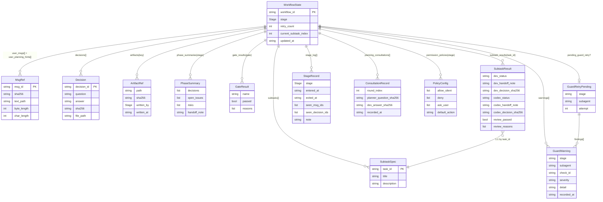

text fallback:

```
                    ┌─────────────────┐
                    │  WorkflowState  │ (root, 22 fields)
                    └────────┬────────┘
                             │
        ┌────────────┬───────┴───────┬─────────────┬───────────────┐
        │            │               │             │               │
        ▼            ▼               ▼             ▼               ▼
    MsgRef[]    Decision[]     ArtifactRef{}  PhaseSummary{}   GateResult{}
    (raw req+   (audit)        (反验后)        (per-stage)      (per-gate)
     hints)        │                                                │
                   └─sha256─→ decision-file 物理文件                 │
                                                                    │
                    SubtaskSpec[]                                   │
                    (planner output)                                │
                            │                                        │
                            ▼                                        │
                    SubtaskResult{}                                 │
                    (per-subtask verbatim)                          │
                                                                     │
    StageRecord[]   GuardWarning[]   ConsultationRecord[]  PolicyConfig{}
    (stage_log)     (warnings)       (planning_consultations) (permission_policies)
                                                                     │
                    GuardRetryPending? (Optional)                    │
                    (retry pending)                                  │
                                                                     │
                                                              一对多 / dict
```

详细字段 schema 见 state.py;每 schema 字段在 SKILL.md "用户怎么验证保真" 验证表都有 cross-ref。

---

## 7. 指标监控报警

### 7.1 完整指标清单（30 个,分 8 类）

#### A. Workflow 生命周期

| 指标 | 类型 | 标签 | 含义 |
|---|---|---|---|
| `shrimp_graph.workflows.created` | counter | — | 累计 start 次数 |
| `shrimp_graph.workflows.done` | counter | outcome={done,blocked} | 累计终止 |
| `shrimp_graph.workflows.duration_seconds` | histogram | outcome | 端到端耗时 |
| `shrimp_graph.workflows.stage_duration_seconds` | histogram | stage | per-stage 驻留 |
| `shrimp_graph.workflows.active` | gauge | — | 活跃 wf 数 |
| `shrimp_graph.workflows.stuck_seconds` | histogram | stage | 距上次 updated_at 时长 |

#### B. Dispatch

| 指标 | 类型 | 标签 |
|---|---|---|
| `shrimp_graph.dispatches.total` | counter | stage, subagent |
| `shrimp_graph.dispatches.duration_seconds` | histogram | stage, subagent |
| `shrimp_graph.dispatches.success` | counter | stage, subagent |
| `shrimp_graph.dispatches.failure` | counter | stage, subagent, reason |

#### C. Anti-Drop Guard

| 指标 | 类型 | 标签 |
|---|---|---|
| `shrimp_graph.guard.findings` | counter | check_id, severity |
| `shrimp_graph.guard.retries_triggered` | counter | stage, subagent, check_id |
| `shrimp_graph.guard.blocked` | counter | stage, subagent, check_id |

#### D. Gate

| 指标 | 类型 | 标签 |
|---|---|---|
| `shrimp_graph.gates.decisions` | counter | gate, answer |
| `shrimp_graph.gates.wait_duration_seconds` | histogram | gate |
| `shrimp_graph.gates.invalid_answers` | counter | gate |
| `shrimp_graph.gates.continue_planning_rejected` | counter | check_id |

#### E. Artifact

| 指标 | 类型 | 标签 |
|---|---|---|
| `shrimp_graph.artifact.verifications` | counter | outcome={match,sha_mismatch,file_missing,unknown_key} |
| `shrimp_graph.artifact.persisted_bytes` | histogram | stage, key |

#### F. Persistence

| 指标 | 类型 | 标签 |
|---|---|---|
| `shrimp_graph.checkpoint.writes` | counter | — |
| `shrimp_graph.checkpoint.write_failures` | counter | reason |
| `shrimp_graph.checkpoint.size_bytes` | gauge | — |

#### G. CLI 边界违规

| 指标 | 类型 | 标签 |
|---|---|---|
| `shrimp_graph.cli.input_rejected` | counter | label, reason |
| `shrimp_graph.cli.commands` | counter | cmd |

#### H. PM-Dev 协商

| 指标 | 类型 | 标签 |
|---|---|---|
| `shrimp_graph.consultation.rounds` | counter | outcome |
| `shrimp_graph.consultation.depth_per_workflow` | histogram | — |

### 7.2 告警规则（10 条,P1/P2/P3 分级）

| # | 告警名 | 触发条件 | 严重度 | 行动 |
|---|---|---|---|---|
| 1 | `WorkflowStuck` | `workflows.stuck_seconds{stage!=GATE_*}` p99 > 1h | P2 | dispatch 卡过久,查 runner / cc-lead |
| 2 | `WorkflowStuckAtGate` | `workflows.stuck_seconds{stage=GATE_*}` p99 > 24h | P3 | 用户没拍 gate,催 |
| 3 | `GuardBlockedSpike` | `rate(guard.blocked)` > 0.1/min | P2 | subagent 行为偏移 |
| 4 | `ArtifactShaMismatchSpike` | `rate(artifact.verifications{outcome=sha_mismatch})` > 0.05/min | **P1** | **数据完整性**,subagent 可能偷改 sha |
| 5 | `ArtifactFileMissingSpike` | `rate(artifact.verifications{outcome=file_missing})` > 0.05/min | **P1** | subagent 撒谎,核心 G5_PROVE severe |
| 6 | `GateInvalidAnswerSpike` | `rate(gates.invalid_answers)` > 0.1/min | P3 | UI / decision-file 模版问题 |
| 7 | `CheckpointWriteFailure` | `rate(checkpoint.write_failures)` > 0 | **P1** | 状态丢失风险,查磁盘 |
| 8 | `CheckpointDBSizeGrowth` | `checkpoint.size_bytes` > 10 GB | P3 | 老 wf 检查点未清理,规划归档 |
| 9 | `ConsultationLoopAbuse` | `consultation.depth_per_workflow` p99 ≥ 3 持续 1h | P3 | planner 频繁触上限 |
| 10 | `CLIInputRejectSpike` | `rate(cli.input_rejected)` > 0.5/min | P3 | 用户/runner 反复传错文件 |

### 7.3 监控面板（4 张）

**面板 1: Workflow 健康总览**:活跃 wf 数 / stage 分布饼图 / e2e 耗时 P50P99 / 完成率
**面板 2: Dispatch 性能**:per-subagent dispatch 耗时分位 / guard 失败热力图 / retry 触发率
**面板 3: Gate 决策**:per-Gate answer 分布 / wait 时长 / invalid_answer 趋势
**面板 4: 数据完整性**:artifact 反验四 outcome 比例 / checkpoint write 失败 / state.db 大小

---

## 8. 火山引擎适配

**MVP 不上火山**，列为 future work。

若后续上火山：
- SqliteSaver → 火山 RDS / ByteDoc（分布式 checkpoint）
- 本地 file artifact → TOS（对象存储）
- 飞书 IM → 走火山 IM 通道
- cc-lead 在火山 BAM / TCE 容器
- 监控走火山 APM + Slardar

---

## 9. 配置相关

13 项配置（详见 DESIGN R9.5）：

7 个 size cap / retry limit 常量 + 4 个路径常量 + 2 个 schema（permission_policies / artifact_paths）。

全部硬编码，无运行时配置中心。未来若加 ConfigCenter 应优先 caps + retry limits。

---

## 10. 升级兼容回滚方案

### 10.1 兼容性矩阵（7 维度 × 向前/向后 兼容性）

| 维度 | 演进点 | 向前(新读旧) | 向后(旧读新) |
|---|---|---|---|
| **A** schema 加字段 | pydantic 加字段 | ✅ default 兜底 | ⚠️ extra 默认 ignore |
| **A** schema 删字段 | — | ⚠️ pydantic v2 默认忽略 | ✅ |
| **A** schema 改 type | — | ❌ 必须迁移 | ❌ 必须迁移 |
| **B** 加新 stage | — | ❌ 路由不在新图 | ❌ 旧版不认 |
| **B** 改 conditional edge | — | ⚠️ | ⚠️ |
| **C** 加 expected_artifacts | — | ⚠️ G5_DECL 触发 | ✅ |
| **D** 加 G_X 检查 | — | ⚠️ retry 时被新规则拦 | ✅ |
| **E** 改 artifact_paths key | — | ❌ 必须迁移 | ❌ |
| **F** LangGraph 升级 | — | 视 release notes | 视 release notes |
| **G** pydantic v1→v2 | — | 必须 model_validator 迁移 | 必须迁移 |

### 10.2 5 条硬规则（演进契约）

1. **state schema 字段只加不删**(MVP-N 内)。删字段需走"标记 deprecated + 至少 N+1 版本观察 + N+2 版本删"
2. **新 G_X 检查只增不强制**。新 check_id 默认 severity=minor;升 severe 需经评审
3. **Stage enum 只追加**。Stage 名字符串落盘后不能改;删除 stage 必须先所有 wf 完成
4. **artifact_paths key 永远向前兼容**。新 key 加,老 key 永不删(只标 deprecated)
5. **graph.py routing 边只加不删**。除非该 conditional 在所有历史 wf 都不可达

### 10.3 升级 SOP

**阶段 1：兼容性评估**
- 列 diff(state.py / graph.py / state.db schema)
- 对照 10.1 矩阵,标"OK / 需迁移 / 不兼容"
- 不兼容项 → 写迁移脚本 + 回归测试

**阶段 2：灰度发布**
- 2.1: dev 环境跑回归(人工新 start + resume 全路径)
- 2.2: 灰度环境 5% wf 跑新版本
- 2.3: 跑 24h 监控指标(P1 告警 / 数据完整性)
- 2.4: 扩到 50% → 100%

**阶段 3：必要时回滚**
- 触发条件见 10.4
- 操作步骤见 10.5

### 10.4 回滚触发条件

**自动**(P1 告警立即回滚):
- `CheckpointWriteFailure` rate > 0
- `ArtifactShaMismatchSpike` rate > 0.5/min
- `ArtifactFileMissingSpike` rate > 0.5/min
- 任何 wf 进入未预期 stage(stage 字段值不在 Stage enum)

**人工**(P2/P3 累积判定):
- `GuardBlockedSpike` 持续 1h
- 用户反馈 "workflow 行为变怪" > 3 例
- e2e 成功率下降 > 5%

### 10.5 回滚步骤

**场景 A: graph.py / graph_cli.py 代码回滚**
```bash
# 1. 停接收新 start
echo "MAINTENANCE" > /var/run/shrimp_graph.maint

# 2. 等当前 in-flight wf 自然完成或 timeout

# 3. 部署回滚版本
git checkout <prev-tag> && make deploy

# 4. 验证 status / resume 跑通
${PY} ${CLI} status --workflow-id <test_wf>

# 5. 解除 maintenance
rm /var/run/shrimp_graph.maint
```
关键:state.db **不动**。回滚后老代码读 state.db 拿旧 schema checkpoint,跑得动(因为升级只加不删)。

**场景 B: state schema 已变(加了新字段不兼容回滚) — worst case**
```python
# state_migration_rollback.py
import sqlite3, pickle
conn = sqlite3.connect(CHECKPOINT_DB)
for row in conn.execute("SELECT * FROM checkpoints"):
    state = pickle.loads(row['checkpoint'])
    if 'new_field_added_in_v3' in state:
        del state['new_field_added_in_v3']
    conn.execute("UPDATE checkpoints SET checkpoint=? WHERE thread_id=?",
                 (pickle.dumps(state), row['thread_id']))
conn.commit()
```
**升级时若改 schema → 必须先备份 state.db**。

**场景 C: 部分 wf 跑坏需强制 BLOCKED**
M3 后:`${PY} ${CLI} force_block --workflow-id <wf> --reason "<text>"`

### 10.6 CI 兼容性测试（5 用例）

每次升级 PR 必须跑:

| 测试名 | 验证 |
|---|---|
| `test_resume_legacy_wf` | 用 v(N-1) 创建的 wf,在 v(N) 能 resume 跑完 |
| `test_state_schema_forward_compat` | v(N-1) state dict 能被 v(N) WorkflowState.model_validate 解析 |
| `test_stage_enum_compat` | v(N) Stage enum 含 v(N-1) 所有成员 |
| `test_artifact_paths_compat` | v(N) artifact_paths 含 v(N-1) 所有 key |
| `test_guard_severity_downgrade` | 新加 G_X 在历史 wf 上不破坏 |

---

## 11. 上线验证

### 11.1 Dry-run 检查清单（10 项,发版前 must）

- [ ] `python ${CLI} start --input-file fixtures/sample_prd.md` 成功创建 wf,返回非空 workflow_id
- [ ] 5 命令各跑一次无 Exception(start / advance / status / resume / dump)
- [ ] `policies.json` 4 个非法形态都 SystemExit:
  - [ ] 含 ask_user 非空
  - [ ] 含 default_action="ask_user"
  - [ ] 非 JSON
  - [ ] 超 64 KiB
- [ ] 跑完整 happy path E2E(假 subagent stub),end state=DONE
- [ ] Gate 3 rollback_to_dev 后 `state.subtask_results={}` 且 `state.current_subtask_index=-1`
- [ ] continue_planning 全 4 hint 文件违规 case 各跑一次,都正确 BLOCKED + 各自的 stage_log note:
  - [ ] no-user-hint-path
  - [ ] unreadable-hint
  - [ ] hint-too-large
  - [ ] hint-not-utf8
- [ ] Anti-Drop Guard severe 触发后能 retry 一次,stage_log 含 `guard-retry-pending:...`
- [ ] result_file 含完整字段:`state.warnings` / `state.guard_retries` / `state.pending_guard_retry` 等
- [ ] state.db 跨 process resume 测试(start 然后 ctrl-C,新 process resume 同 wf_id)
- [ ] 兼容性测试 5 个 CI 用例 PASS(test_resume_legacy_wf / test_state_schema_forward_compat / test_stage_enum_compat / test_artifact_paths_compat / test_guard_severity_downgrade)

### 11.2 验收标准

通过 = 10 项全 ✅。任一未通过 → 发版 hold,issue 修复后重跑。

### 11.3 验证执行人

| 验证项 | 负责人 |
|---|---|
| Dry-run | dev |
| 兼容性测试 | CI 自动 |
| 监控告警基线 | SRE |

---

## 12. 风险评估

### 12.1 风险评估矩阵（24 个,按"概率 × 影响"评分）

| ID | 风险描述 | 概率 | 影响 | 评分 | 类别 |
|---|---|---|---|---|---|
| **R-01** | 同一 wf_id 并发 resume → 后写覆盖,state 不一致 | 中 | 高 | **HIGH** | 状态一致性 |
| **R-02** | --input-file argparse 不强制,省略时 pm_agent 拿空 context | 高 | 中 | **HIGH** | 用户体验 |
| **R-03** | --policies-file partial-override,其他 5 stage 无 policy → cc-lead 失控 | 中 | 高 | **HIGH** | 安全 |
| **R-04** | DEV artifact last-write-wins,历史在磁盘丢失 | 高 | 中 | **HIGH** | 数据完整性(已通过 state.subtask_results 补偿) |
| **R-05** | subagent 偷改 artifact sha | 低 | 高 | MED | 已 G5_PROVE sha-mismatch 防御 |
| **R-06** | subagent 撒谎 artifact 文件不存在 | 低 | 高 | MED | 已 G5_PROVE file-missing severe 防御 |
| **R-07** | 中间 LLM 摘要 handoff_note | 中 | 高 | **HIGH** | 已规则化但靠 Hermes 自律 |
| **R-08** | retry-pending 被误读为 BLOCKED | 中 | 中 | MED | 已 stage_log note 文档化 |
| **R-09** | gate_results["Gate 1.5"] 反映最后一轮 claim | 低 | 低 | LOW | audit 解释 |
| **R-10** | state.gate_results["Gate 2"] synthetic 非 verbatim | 低 | 低 | LOW | 已文档化 |
| **R-11** | rollback_to_dev 预期"带反馈重跑" | 高 | 中 | **HIGH** | 用户体验(已文档化) |
| **R-12** | codex review-failure 触发 G4 minor → 噪音 | 高 | 低 | MED | 已文档化 |
| **R-13** | Hermes 在 gate 不逐字 quote payload.options | 中 | 高 | **HIGH** | 已规则化 |
| **R-14** | Hermes 不 relay phase_summary / subagent_gate_claim | 中 | 高 | **HIGH** | 已规则化 |
| **R-15** | IM 长度超 cap → Hermes 截断 / 摘要 | 中 | 高 | **HIGH** | 已规则化为拆条 / 引导 dump |
| **R-16** | workflow 卡死无 cancel 命令 | 中 | 中 | MED | 待 M3 实现 force_block |
| **R-17** | state.db disk full → checkpoint write 失败 | 低 | 高 | MED | 持久化 |
| **R-18** | state schema 升级不兼容 → 老 wf resume 失败 | 中 | 高 | **HIGH** | 已 5 条硬规则 |
| **R-19** | 多 workflow 共享 state.db,文件锁 contention | 低 | 低 | LOW | 性能 |
| **R-20** | Anti-Drop Guard G_X 字段缺失抛异常 → workflow 不可恢复 | 低 | 高 | MED | 健壮性 |
| **R-21** | gate decision-file decision_id 未填,orch 静默用 default | 中 | 低 | MED | audit |
| **R-22** | planner 复用 pm_agent SKILL.md,runner 找错契约 | 低 | 高 | MED | 已文档化(R50) |
| **R-23** | hint 文件超 64 KiB 或非 UTF-8 → BLOCKED | 低 | 低 | LOW | 已 4 check_id 防御 |
| **R-24** | feishu IM 服务挂 → Hermes 同步不出去 | 低 | 低 | LOW | 已 doc "不影响主流程" |

### 12.2 HIGH 风险 mitigation 详表

#### R-01: 并发 resume race
- **现状**:无 application-layer mutex
- **mitigation**:
  - doc 层(已):严格规则增加"同一 wf_id 同时只能一次未完成 resume"
  - code 层(待):graph_cli 加 fcntl.flock 保护
  - 监控:checkpoint.writes rate / workflows.active 比对

#### R-02: --input-file footgun
- **mitigation**:短期 doc 强警告(R41);长期 argparse 加 `required=True`

#### R-03: --policies-file partial-override
- **mitigation**:doc(R42);长期 `_load_policies_file` 改为"用户 policies 与 default 合并"模式

#### R-04: DEV artifact last-write-wins
- **mitigation**:doc(R21);长期可选 per-subtask path(`artifacts/dev/T-001/*`)

#### R-07 / R-13 / R-14 / R-15: 输入飘移依赖 Hermes 自律
- **mitigation**:当前 Hermes 单点信任;长期加 Hermes-side validator 校验 IM 实际 quote 内容 sha-pinned 等于 state 原文

#### R-11: rollback_to_dev 误期
- **mitigation**:doc(R11)+ Hermes 在 Gate 3 呈现 options 时点出"全清重跑"语义

#### R-18: state schema 升级
- **mitigation**:5 条硬规则(§10.2)+ CI 5 兼容性测试 + worst-case migration script

### 12.3 风险与监控关联

| 风险 ID | 对应监控 |
|---|---|
| R-01 | `checkpoint.writes` rate / `workflows.active` 比对 |
| R-04 R-05 R-06 | `artifact.verifications` outcome 分布 |
| R-07 R-13 R-14 R-15 | 无直接监控,需抽样审计 IM |
| R-08 | `guard.retries_triggered` 与"用户 abort"关联 |
| R-12 | `guard.findings{check_id=G4}` 分布 |
| R-17 | `checkpoint.write_failures` |
| R-18 | CI 兼容性测试通过率 |
| R-21 | `gates.decisions` 中 decision_id=default 比例 |

### 12.4 takeaways

- **24 个风险**,其中 **10 个 HIGH**(并发 race / 用户体验 footgun / 决策权依赖 LLM 自律 / 升级兼容)
- **HIGH 风险大部分已通过 doc 规则约束**,真正需 code 修的是:R-01 加 mutex / R-02 argparse 必传 / R-03 policies 合并
- **输入飘移类风险(R-07/R-13/R-14/R-15) 是系统性挑战** —— Hermes 自律是单点信任,长期需 validator 介入

---

## 13. 场景 review

### 13.1 顺利路径(SOP-1,SKILL.md 三条 SOP 第一条)

PRD 提交 → PM → Gate 1 approve → PLAN → Gate 1.5 approve → DEV × N subtask → Gate 2 approve → REV → Gate 3 approve → DONE

resume 次数 = `8 + 2N + 2R`(N=subtask 数,R=协商轮数)。

### 13.2 跨阶段回滚(SOP-2,SKILL.md 三条 SOP 第二条)

例:在 Gate 1.5 处发现 PM 阶段需求有缺漏 → rollback_to_pm → PM 重做 → Gate 1 re-approve → PLANNING re-run → Gate 1.5 approve。

state 变化:`retry_count` +1,`rollback_counts["PM_PHASE"]` +1,`phase_summaries["PM_PHASE"]` / `phase_summaries["PLANNING_PHASE"]` 被新一轮覆盖(prev_phase_summary 字段保留老内容给 subagent 参考)。

### 13.3 阻塞路径(SOP-3,SKILL.md 三条 SOP 第三条)

两种入口:
- 用户在任意 Gate reject → stage=BLOCKED,stage_log 末位 `gate-N-rejected:reject`
- Anti-Drop Guard severe 重试仍失败 → stage=BLOCKED,stage_log 末位 `guard-blocked:<subagent>:[<ids>] (after 1 retry)`

恢复:无 cancel 机制,只能 start 新 wf。state.db 里旧 wf 行保留作历史。

### 13.4 协商达上限(SOP-4)

planner 在 PLANNING_PHASE 报 status=needs_input + dev_consultation 字段非空,触发 planning_dev_consult dispatch dev_agent 咨询模式。3 轮后 planner 仍未 done → orch 把 stage 推到 GATE_1_5,append `PLANNING_CONSULT_LIMIT` minor warning,stage_log 末位 `planning-needs-input-surface-to-gate:exhausted=True`。

用户在 GATE_1_5 选:
- `continue_planning` + 给 hint 文件 → 协商额度重置为 0,planner 再 3 轮
- `rollback_to_pm` → 回 PM 重做
- `reject` → BLOCKED

### 13.5 DEV 中途 codex 失败(SOP-5)

DEV 阶段 T-002 跑完 dev_agent 后 codex_reviewer 返回 `passed=false`(`status=done`)。
- **DEV 不中断**(SKILL.md line 75)
- `state.subtask_results[T-002].review_passed=false`,`review_reasons` 记原因
- 继续 T-003 ...
- 队列耗尽时 dev_loop_router 合成:`phase_summaries["DEV_PHASE"]` 含 synthetic handoff + open_issues(per review_reason 一行),`gate_results["Gate 2"]` 是 synthetic GateResult(`passed=all_passed=false`)

用户在 GATE_2 看到 `subagent_gate_claim.passed=false` + reasons 中含失败 subtask → 决定:
- `approve`(认可,带瑕疵进 REV)
- `rollback_to_planning`(plan 拆分有问题)
- `rollback_to_pm`(spec 本身有问题)
- `reject`

### 13.6 Gate 3 codex_final 三向 rollback(SOP-6)

REV 阶段 codex_final 返回 `passed=false` → `gate_results["Gate 3"]=GateResult(passed=False, ...)`。Gate 3 给用户 5 个选项:`approve / rollback_to_dev / rollback_to_planning / rollback_to_pm / reject`。

用户依据 codex_final 的 reasons 判断问题层次:
| 问题类型 | 选择 | state 变化 |
|---|---|---|
| 代码实现 bug | `rollback_to_dev` | subtask_results 清空, current_subtask_index=-1 |
| subtask 拆分本身有问题 | `rollback_to_planning` | retry++, rollback_counts++ |
| 需求理解就错 | `rollback_to_pm` | retry++, rollback_counts++ |
| 实在不行 | `reject` | BLOCKED |

### 13.7 workflow 卡死手工 force_block(SOP-7,M3 才有)

当前(M0)没有 cancel 命令。workflow 真卡死(如 cc-lead crash 不 resume)只能放着。

M3 后会加 `${PY} ${CLI} force_block --workflow-id <wf> --reason <text>` 命令,把 stage 推到 BLOCKED,stage_log 末位 `force-blocked:<reason>`,后续命令也只读不动。

### 13.8 协商 / retry / DEV 期 status 调用看到的内容(SOP-8)

| 场景 | stage | pending_interrupt.payload | 关键字段 | 用户应理解为 |
|---|---|---|---|---|
| 协商中(planner 等 dev 答) | PLANNING_PHASE | subagent_dispatch + subagent="dev_agent" + input_payload.consultation_mode=True | planning_consultation_round 已增 | "PLANNING 内部 dev 咨询中,非 DEV" |
| guard severe retry pending | (前一 stage 不变) | subagent_dispatch(同节点)+ guard_failure_hint 非空 | pending_guard_retry 非空,stage_log 末位 `guard-retry-pending:...` | "guard 拦截了 attempt 1,正在重 dispatch 给 attempt 2" |
| DEV 中 T-k 跑期间 | DEV_PHASE | subagent_dispatch + subagent="dev_agent" + input_payload.current_subtask | current_subtask_index=k | "DEV 第 k 个 subtask 进行中" |

---

## 14. 测试用例

### 14.1 测试金字塔（90 用例分 6 类）

| 类别 | 数量 | 覆盖率目标 | 初次工期 |
|---|---|---|---|
| 单元测试 | ~50 | 行 > 85%, 分支 > 80% | 1 周 |
| 集成测试 | ~20 | 各 _node / _route 至少 1 | 1 周 |
| E2E | ~5 | 主路径 + 关键 rollback | 3 天 |
| 性能 | ~4 | 基线建立 | 2 天 |
| 安全 | ~4 | 边界硬拒 | 1 天 |
| 回归 / 兼容性 | ~5 | 跨版本 | 2 天 |

### 14.2 单元测试 ~50 用例

**A. Anti-Drop Guard 6 个检查(20 用例)**

UT-G1-01..03: G1 status 缺失 / 非法 / 合法
UT-G3-01..03: G3 stage 缺失(OK) / drift(severe) / match
UT-G4-01..03: status=done & passed=false / passed=false & status=blocked / OK
UT-G5_DECL-01..02: expected 全覆盖 / 缺 key
UT-G5_PROVE-01..04: 文件 sha 匹配 / sha 不匹配 / 文件不存在(severe) / 未知 key(minor)
UT-G6-01..04: handoff_note 空 / 多行 / >280 字符 / 合法

**B. retry 路径 `_handle_guard_outcome`(4 用例)**

UT-RETRY-01..04: 首次 severe / 第二次 severe → BLOCKED / 全 minor / 不同 (stage, subagent) 各自独立

**C. CLI 边界验证 graph_cli.py(7 用例)**

UT-CLI-01..03: --input-file 超 256 KiB / 非 UTF-8 / 路径不存在
UT-CLI-04..05: --policies-file ask_user / default_action="ask_user"
UT-CLI-06..07: --decision-file 非 JSON / top-level 不是 object

**D. 状态转换路由 `_route_after_*`(7 用例)**

UT-ROUTE-01..07: 覆盖 gate_1/1_5/2/3 + planning + dev_loop + dispatch_outcome 各 router

**E. Schema 反序列化(5 用例)**

UT-SCHEMA-01..05: WorkflowState 默认 / MsgRef 缺字段 / Stage enum 解析 / SubtaskResult 默认 / PolicyConfig validation

**F. 辅助函数(7 用例)**

UT-HELPER-01..07: `_sha256_file` / `_sha256` / `_phase_summary_dump` / `_parse_subtask_plan`(含 malformed) / `_consume_pending_retry` / `_default_artifact_paths` / `_default_policies`

### 14.3 集成测试 ~20 用例(pytest + 真 SqliteSaver)

**A. 单 workflow 完整路径(10)**
- IT-PATH-01: 顺利路径 start → 5 dispatch + 4 gate approve → DONE
- IT-PATH-02..03: Gate 1 reject / rollback_to_pm
- IT-PATH-04..07: continue_planning 成功 + 4 个 hint 违规 case
- IT-PATH-08: Gate 2 rollback_to_planning
- IT-PATH-09: Gate 3 rollback_to_dev(subtask_results 清空 + current_subtask_index=-1)
- IT-PATH-10: invalid answer at any gate(severe GATE_INVALID_ANSWER, BLOCKED)

**B. Anti-Drop Guard retry E2E(3)**
- IT-RETRY-01: pm_agent 首次 status=非法 → retry pending
- IT-RETRY-02: pm_agent retry 修正 status=done → 正常进 GATE_1
- IT-RETRY-03: pm_agent retry 仍 severe → BLOCKED + `guard-blocked` note

**C. PM-Dev 协商(3)**
- IT-CONSULT-01: 3 轮内 done
- IT-CONSULT-02: 第 4 次仍 needs_input → GATE_1.5 + PLANNING_CONSULT_LIMIT
- IT-CONSULT-03: continue_planning 重置 round=0

**D. DEV 多 subtask(4)**
- IT-DEV-01: N=3 全过,subtask_results 3 entries
- IT-DEV-02: 中间 codex passed=false 不中断
- IT-DEV-03: dev_agent status=blocked 单 subtask 不中断
- IT-DEV-04: subtask_plan 为空 → 直接 GATE_2

### 14.4 E2E 测试 ~5 用例(真 cc-lead + 真 LLM)

- E2E-01: 完整 PRD → DONE 顺利路径
- E2E-02: 用户在 Gate 1.5 continue_planning 一次,planner 收到 hint 出新 subtask_plan
- E2E-03: DEV 阶段 codex 故意 fail 一个 subtask,用户 rollback_to_planning
- E2E-04: Gate 3 rollback_to_dev 后重跑全 DEV
- E2E-05: 端到端 + IM 一致性审计(Hermes 发的所有 IM 中 handoff_note / reasons sha-pinned == state 原文)

### 14.5 性能 / 压测 ~4 用例

- PERF-01: 单 workflow e2e < 30 min(主观目标,实测建立基线)
- PERF-02: 100 workflow 并发(不同 wf_id),state.db 锁 contention < 5%, p99 latency < 10s
- PERF-03: state.db 含 1000 历史 wf,start 命令 < 1s
- PERF-04: 单 wf 写 50 MB artifact,sha256 反验 < 5s

### 14.6 安全 / 权限 ~4 用例

- SEC-01: --policies-file 含 ask_user 非空 → SystemExit
- SEC-02: --policies-file 含 default_action="ask_user" → SystemExit
- SEC-03: dispatch_payload.permission_policy 正确设置,runner 渲染后 cc-lead 不能跑 sudo / git push --force
- SEC-04: hint 文件超 64 KiB(防 wedge attack)→ SystemExit + BLOCKED

### 14.7 回归 / 兼容性 ~5 用例(CI 必跑)

| 测试名 | 验证 |
|---|---|
| REG-01 | v(N-1) 创建的 wf 在 v(N) 能 resume |
| REG-02 | state schema 向前兼容(default 兜底) |
| REG-03 | Stage enum 兼容(v(N) 含 v(N-1) 所有) |
| REG-04 | artifact_paths key 兼容(v(N) 含 v(N-1) 所有) |
| REG-05 | 全部 IT 用例在 v(N) PASS |

### 14.8 测试代码组织

```
shrimp/orchestrator/tests/
├ unit/
│  ├ test_guard.py          (UT-G*-* 20)
│  ├ test_retry.py          (UT-RETRY-* 4)
│  ├ test_cli.py            (UT-CLI-* 7)
│  ├ test_routes.py         (UT-ROUTE-* 7)
│  ├ test_schemas.py        (UT-SCHEMA-* 5)
│  └ test_helpers.py        (UT-HELPER-* 7)
├ integration/
│  ├ test_paths.py          (IT-PATH-* 10)
│  ├ test_retry_e2e.py      (IT-RETRY-* 3)
│  ├ test_consultation.py   (IT-CONSULT-* 3)
│  └ test_dev_loop.py       (IT-DEV-* 4)
├ e2e/
│  └ test_full_workflow.py  (E2E-* 5)
├ perf/
│  └ test_perf.py           (PERF-* 4)
├ security/
│  └ test_security.py       (SEC-* 4)
└ regression/
   └ test_compat.py         (REG-* 5)
```

---

## 15. 上线流程

8 步标准流程（详见 DESIGN R9.8）：PR review → CI → 兼容性测试 → Dry-run → 灰度 5% / 24h → 监控 → 100% → 文档归档。

---

## 16. 评审结论

| 评审项 | 结论 | 评审人 | 日期 |
|---|---|---|---|
| 背景与方案概述 | | | |
| 架构设计 | | | |
| 详细方案 / 并发 Case | | | |
| 指标监控 | | | |
| 升级兼容 | | | |
| 测试用例 | | | |
| 风险评估 | | | |
| **总体** | | | |

---

## 17. Milestone 排期

| Milestone | 内容 | 时间 |
|---|---|---|
| M0 (now) | doc 草稿 + 评审反馈 | T+0 |
| M1 | ~90 测试 + 30 指标埋点 | T+2 周 |
| M2 | 兼容性 CI + 灰度工具 | T+3 周 |
| M3 | force_block + fcntl lock (R-01) | T+4 周 |
| M4 | --input-file required + policies 合并 (R-02 / R-03) | T+5 周 |
| M5 | E2E + 上线 dry-run | T+6 周 |
| M6 | v1.0 发布 | T+7 周 |

---

## 附录 A：与 SKILL.md 的分工

| 文档 | 受众 | 用途 | 维护节奏 |
|---|---|---|---|
| `SKILL.md` | LLM / runner | 操作 runbook | 跟 graph.py 同步演进 |
| `DESIGN.md`（本文） | 评审委员会 / 人类设计审视 | 一次性技术评审 + 长期方案参考 | 评审通过即归档，重大改造时重启 |

部分内容跨文档冗余（如状态机图、Anti-Drop Guard 规则）；DESIGN.md 偏架构论证，SKILL.md 偏字段精确契约。

---

## 附录 B：whiteboard 图清单（待飞书实现）

| # | 图名 | 内容 | 章节 |
|---|---|---|---|
| 图 1 | 组件分层架构图 | 5 swimlane | §4.2 |
| 图 2 | 数据流图 | 4 阶段 + artifact 流转 | §4.3 |
| 图 3 | 细化状态机图 | 带 transition condition 标签 | §4.3 |
| 图 4 | Anti-Drop Guard 判定树 | 6 G_X 检查流图 | §4.3 |
| 图 5 | 责任分工矩阵 R&R 表 | 14 行为 × 6 actor | §4.2 |
| 图 6 | 并发 Case 时序图 ×8 | 每个 case 一张 Mermaid sequence | §4.4 |
| 图 7 | ER 图 | 13 BaseModel 关系 | §6 |

---

**草稿 v0.1 起草完毕。** 下一步：
1. 评审委员会基于本骨架补具体内容（背景部分、TODO 占位的章节）
2. whiteboard 图 1-7 移到飞书 whiteboard 实现（**详细计划见 Appendix B**）
3. 反馈后迭代到 v0.2 → v1.0

---

## Appendix B：飞书画板补全计划

### B.1 背景与必要性

DESIGN.md 当前嵌入 **11 张 Mermaid 图**(渲染在飞书文档代码块或 GitHub 等支持 Mermaid 的渲染器里)。问题:
- **静态渲染**:Mermaid 图是 SVG 一次性输出,**评审时读者无法交互**——不能点开节点看详情、不能展开/折叠层级、不能跟节点关联评论
- **协作摩擦**:飞书评审在文档侧批注的关联点是文档锚,Mermaid 图节点本身不能被批注
- **演示效果**:复杂图(尤其 swimlane 6 道、ER 图、并发时序)在 Mermaid 上**信息密度不如真飞书画板**(后者支持手动调节布局、突出关键路径)

**解法**:用 `design-lark-chart` skill 把关键图转成**真飞书画板**(`whiteboard`),DESIGN.md 里保留 Mermaid 源码作 ground truth + version-控制可读形态,飞书画板作交互呈现层。

### B.2 11 张图的路由推荐

`design-lark-chart` 有两条主要路由(参考 `skill/references/02-chart-taxonomy.md`):
- **代码原生路由(mermaid)**:`.mmd` → `lark-cli whiteboard +update --input_format mermaid` → 飞书原生代码渲染。适合飞书画板**已原生支持**的图型:`state-machine` / `sequence` / `flowchart` / `er-diagram`。零额外 schema 转换,Mermaid 源码就是 ground truth
- **DSL 路由**:plan.json → board.json (DSL v2) → `whiteboard-cli --to openapi` → `lark-cli whiteboard +update`。适合飞书画板原生**不支持**的图型,如 `swimlane` / `lark-style-architecture` / `business-architecture`,以及强视觉验收需求(`system-architecture` / `matrix-quadrant`)

| # | DESIGN.md 章节 | 图名 | Mermaid 类型 | 推荐路由 | 理由 |
|---|---|---|---|---|---|
| 1 | §3.2 状态机骨架 | shrimp graph 11 stage 状态机 | `stateDiagram-v2` | **代码原生(mermaid)** | 11 个 stage + 24 条 transition,飞书原生 mermaid state diagram 支持,无需 DSL 介入 |
| 2 | §4.2 图1 | 组件分层架构图(6 swimlane:用户 / Hermes / graph_cli / Graph / Runner / Persist) | `flowchart TB` + `subgraph` × 6 | **DSL complex-swimlane** | 飞书 mermaid 对 `flowchart subgraph` 渲染较弱,跨 lane 箭头容易堆叠。6 actor + 跨泳道多跳消息属 `complex-swimlane`(02-chart-taxonomy.md #5),走 DSL 走专门布局引擎 |
| 3 | §4.2 图5 | R&R 责任分工矩阵 14 行为 × 6 actor | (现在是表格,不是 Mermaid) | **保留表格** + 可选 DSL `matrix-quadrant` 演变 | 当前 markdown 表已经清晰,飞书 docx 直接表格 + cell-level 批注比画板更适合 R&R |
| 4 | §4.3 图2 | 数据流图 4 阶段 artifact 流转 | `flowchart LR` | **代码原生(mermaid)** | 普通流程图,飞书 mermaid 支持。LR 方向 + artifact 节点适合 mermaid |
| 5 | §4.3 图3 | 细化状态机图(condition 标签) | 当前只有 text fallback,未画 Mermaid | **前置条件：需先补 Mermaid stateDiagram-v2 源码再定路由** | 跟图 1 同型,补 mermaid `stateDiagram-v2` 后走代码路由 |
| 6 | §4.3 图4 | Anti-Drop Guard 判定树 | `graph TD` (decision tree) | **代码原生(mermaid)** | 判定树是 flowchart 子集,飞书 mermaid 支持 graph TD;严重/轻微节点可用颜色区分 |
| 7 | §4.4 C-1 | 并发 Case 1 时序图 (resume race) | `sequenceDiagram` | **代码原生(mermaid)** | 飞书 mermaid 原生 sequence diagram |
| 8 | §4.4 C-2 | 并发 Case 2 时序图 (status during dispatch) | `sequenceDiagram` | **代码原生(mermaid)** | 同上 |
| 9 | §4.4 C-5 | 并发 Case 5 时序图 (write failure) | `sequenceDiagram` | **代码原生(mermaid)** | 同上 |
| 10 | §4.4 C-7 | 并发 Case 7 时序图 (retry-pending status) | `sequenceDiagram` | **代码原生(mermaid)** | 同上 |
| 11 | §4.4 C-8 | 并发 Case 8 时序图 (consult mode status) | `sequenceDiagram` | **代码原生(mermaid)** | 同上 |
| 12 | §6.3 ER 图 | 13 BaseModel + WorkflowState 关系 | `erDiagram` | **代码原生(mermaid)** | 飞书 mermaid 原生 erDiagram,字段表 + 关系基数都支持 |

**汇总**:11 张需要画板化的图里,**10 张走代码原生(mermaid)**、**1 张走 DSL**(§4.2 图1 6 swimlane 架构图)。

### B.3 操作步骤(分两批)

#### 批次 1:代码原生路由 (10 张 mermaid 图)

**【前置】** 每次生成前必须先加载 skill：`skill_view(name='design-lark-chart')`，并严格按 `references/01-pipeline.md` 八步执行。

**【步骤 0:补 §4.3 图3 Mermaid 源码】** §4.3 图3"细化状态机图(condition 标签)"当前只有 text fallback,**必须先在 DESIGN.md §4.3 补 Mermaid `stateDiagram-v2` 源码**(可从 text fallback 描述还原),否则整条 pipeline 无法启动。批次 1 其余 9 张图(§3.2 / §4.3 图2 / §4.3 图4 / §4.4 C-1..C-8 / §6.3 ER 图)源码已存在,可直接走步骤 1。

每张图重复以下流程:

```bash
# 1. 从 DESIGN.md 抽取 mermaid 块到独立 .mmd 文件
# 例:§3.2 状态机
cat > /tmp/state-machine.mmd <<'EOF'
stateDiagram-v2
  [*] --> INIT
  INIT --> PM_PHASE
  ...
EOF

# 2. 用 design-lark-chart skill 触发(它会自动走 mermaid 路由 + 飞书 +update + 回读验证)
# 触发语义示例: "把这张 mermaid 状态机图同步到飞书画板"
# skill 会执行: 
#   - 验证 .mmd 语法
#   - lark-cli whiteboard +update --input_format mermaid <file>
#   - lark-cli whiteboard +query --output_as code  # round-trip 校验
#   - Gate B 真实飞书导出图视觉验收

# 3. 拿到飞书画板 URL/Token,回填到 DESIGN.md
#    Token 落盘到 `data/design-lark-chart/whiteboard-urls.json`(与 DESIGN.md 同版本化管理),
#    结构:`{"<diagram-id>": {"commit": "<hash>", "token": "<token>", "url": "<url>"}}`
#    DESIGN.md 回填格式:`> 飞书画板(交互版):[链接@v{commit}](https://bytedance.larkoffice.com/whiteboard/{token})`
```

**预期产物每张**:
- 飞书画板 URL(评审人点击交互查看)
- `roundtrip.code.json`(回读 mermaid 源码,确认无失真)
- 飞书端导出图 PNG(Gate B 视觉验收)
- `data/design-lark-chart/whiteboard-urls.json` 中追加一条记录(diagram-id, commit, token, url)

#### 批次 2:DSL complex-swimlane 路由 (§4.2 图1 组件分层架构图)

**【前置】** 每次生成前必须先加载 skill：`skill_view(name='design-lark-chart')`，并严格按 `references/01-pipeline.md` 八步执行。

这张 6 swimlane 不能简单 .mmd round-trip,需要走完整 Normalize → Select → Plan → Layout → Render → StaticCheck → VQA → Deliver 八步管道:

```text
1. Normalize:  按 design-lark-chart skill 的 Normalize 步骤规范执行，输出符合 references/04-planner-contract.md 的 plan.json 结构
2. Select:    chart-type = complex-swimlane (02-chart-taxonomy.md 中 #5)
3. Plan:      根据 style-tokens 决定 swimlane 颜色(每 lane 一色)+ 字号 + 圆角
4. Layout:    whiteboard-cli flex 布局,泳道宽度等分
5. Render:    plan.json → board.json (DSL v2)
6. StaticCheck: scripts/check_board.sh (errors=0, warnings=0)
7. VQA:       双 reviewer 视觉评分 ≥9
              ⚠️ 若 VQA 评分 <9 或 blocker：退回 Layout 重做（最多 3 次后升级人工）
              ⚠️ VQA 依赖 ui-designer subagent；若 ui-designer 能力不可用，
                 DSL swimlane 须**推迟交付**而非跳过质量门（不允许带病上线）
8. Deliver:   lark-cli whiteboard +update --input_format dsl
```

**关键质量门**(参考 `06-quality-gates.md`):
- `whiteboard-cli --check` errors > 0 → 修复
- VQA 任一评分 < 9 或出现 blocker → 退回 Layout 重做
- 真实飞书端导出图(等 2s 重试一次)Gate B 验收

### B.4 在飞书文档里嵌入/链接的方式

设 DESIGN.md 主体已发布到飞书 docx(URL: `https://bytedance.sg.larkoffice.com/docx/XXXXXX`)。3 种嵌入方式:

#### 方式 1:飞书画板 inline 嵌入(推荐)

每张飞书画板生成后拿到画板 token,在 docx 里 `/插入 → 画板` 选已有画板,飞书会自动 inline 渲染。读者可在 docx 里**直接点开节点看详情**,跟段落注释绑定。

适用:§3.2 状态机、§4.2 图1 swimlane(因交互价值最高)

#### 方式 2:URL 链接 + 缩略图

某些图(如并发 case 时序图 ×5)交互价值低,但页面占位大。可以在 docx 里只放**链接 + 缩略图**:

```markdown
- C-1: 并发 resume race | [飞书画板 →](url) | 
- C-2: status during dispatch | [飞书画板 →](url) | 
- ...
```

读者按需点开,文档主体保持紧凑。

适用:§4.4 C-1 .. C-8 5 张时序图

#### 方式 3:保留 Mermaid 不画板化

某些图本身静态可读、交互需求弱(如 ER 图字段表、判定树),可以**仅保留 Mermaid 渲染**,不另做飞书画板。

适用:§4.3 图4 判定树(简单)、§6.3 ER 图(主要看字段表非交互)

### B.5 推荐分层取舍

按"交互价值 vs 实施成本"分三档:

| 档位 | 适用图 | 路由 | 实施成本 |
|---|---|---|---|
| **必做** | §3.2 状态机骨架 + §4.2 图1 swimlane + §4.3 图3 细化状态机 | mermaid + DSL | 中(swimlane 走 DSL 八步管道;§4.3 图3 须先补 Mermaid 源码) |
| **推荐** | §4.3 图2 数据流 + §4.3 图4 Anti-Drop Guard 判定树 + §4.4 C-1/C-7 时序图 | mermaid 路由 | 低(代码原生) |
| **可选** | §4.4 C-2/C-5/C-8 + §6.3 ER 图 | mermaid 路由 / 保留 | 低 |

**起手建议**:先做"必做" 2 张(占评审最高交互价值),如果效果好再扩展到"推荐"4 张,"可选"档按反馈再决定。

### B.6 Appendix B takeaways

- DESIGN.md **保留 11 张 Mermaid 源码作 ground truth**(可 diff / version-control / 跨工具)
- 飞书画板 = **演示/交互层**,通过 `design-lark-chart` skill 生成,在飞书 docx 里 inline 嵌入或 link 引用
- 路由策略明确:**10 张走代码原生(mermaid)**、**1 张走 DSL(swimlane)**
- 实施分批:批次 1 高 ROI(10 张 mermaid 圈完),批次 2 重投入(1 张 swimlane 走完整八步管道)
- 不动 DESIGN.md 现有 Mermaid 代码块,只在 Appendix B 加补全计划描述
- 版本策略：**一次性迁移** — DESIGN.md 发布评审前一次性生成所有画板(本 Appendix 即定义起手范围);**后续更新** — 通过 commit message 加 `!lark` tag 触发受影响图形重跑(diagram-id 在 `data/design-lark-chart/whiteboard-urls.json` 索引),画板 URL 按 `git commit-hash` 标签管理，跨文件引用格式：`[飞书画板@v{commit}](url)`

---
