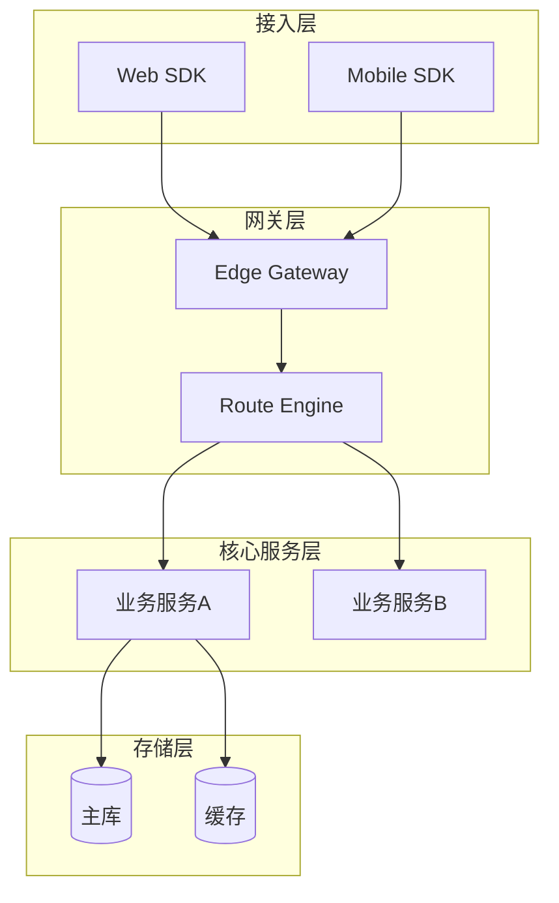
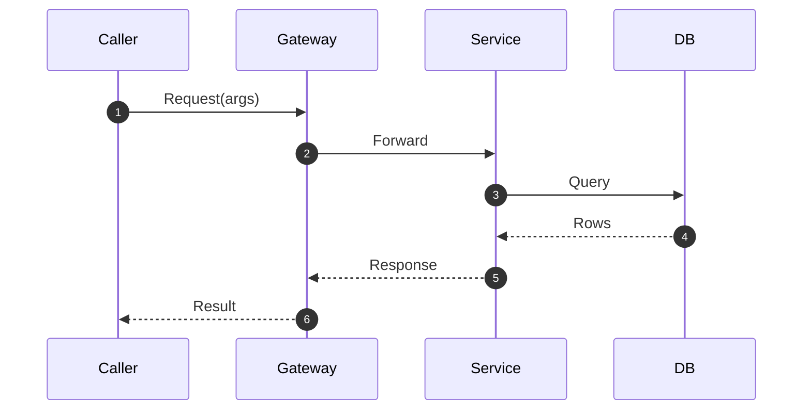
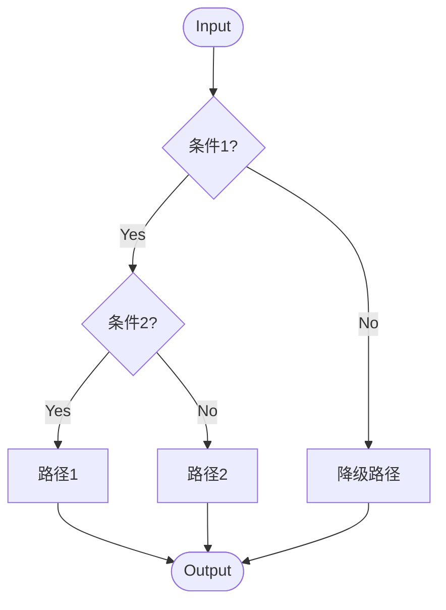
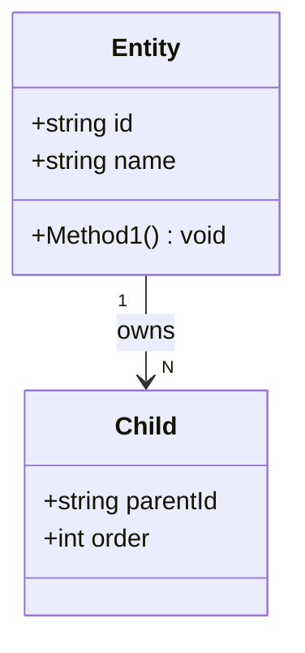
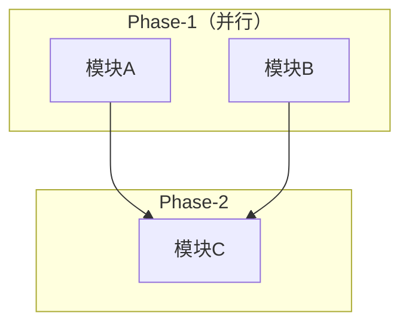
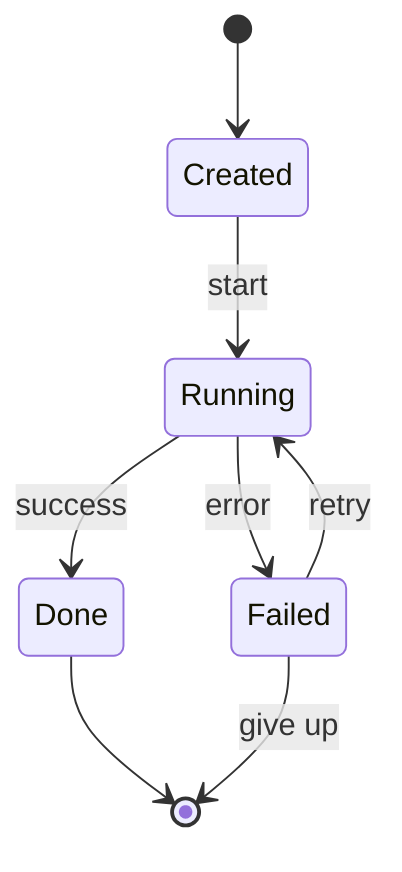

# 文档模板库

本文档定义各类文档的模板结构。

---

## 0. 图表（Mermaid）使用指引

> **v2.3.0 新增**：把 `{{include_diagram}}` 由"自由占位"升级为"按场景选 mermaid 块"。
> **强度**：建议级（warning），未达成不阻塞输出；硬阈值由 pm_agent Gate 1.5.7~1.5.9 检查。
> **示例**：见 §1（tech_review）、§2（design_doc）、§4（module_plan）三处实际占位。
>
> **v2.4.0 新增（飞书画板自动升级规则）**：当 doc_output 把产物发布到飞书 docx 后，`chart_publisher.publish_chart()` 会**按图代号挑选**是否自动把 mermaid 块升级成可交互的飞书画板：
>
> | 图代号 | 飞书发布后是否自动升级为画板 | 原因 |
> |---|---|---|
> | **D-ARCH** | ✅ 升级 | 评审场景高频展示，inline 互动价值最高 |
> | **D-SEQ** | ✅ 升级 | 时序图分支多，互动看节点比 SVG 友好 |
> | **D-DAG** | ✅ 升级 | 模块依赖图常需点开节点看任务详情 |
> | D-CLASS | ❌ 保留 mermaid | 字段表为主，互动需求低；mermaid 渲染已够清晰 |
> | D-STATE | ❌ 保留 mermaid | 状态机文本注解多，画板转换会丢标签语义 |
> | D-DECISION | ❌ 保留 mermaid | 短决策树，inline mermaid 比画板更紧凑 |
> | D-ERR | ❌ 保留 mermaid | 错误码流程通常嵌在错误码定义表附近，宜紧凑 |
> | D-REVERSE-SEQ | ❌ 保留 mermaid | 同 D-SEQ 类，但 `Note over` 注解在画板里渲染不稳 |
> | D-GANTT / D-MIND / D-MATRIX | ❌ 保留 mermaid | 飞书画板对这三类原生支持弱，转 DSL 收益低 |
>
> 升级后，原 mermaid 块**仍保留在本地 markdown ground truth 中**（作版本控制、diff、跨工具复用）；飞书 docx 里只追加 `<whiteboard token="..."/>` 引用 + 由 chart_publisher round-trip 验证一致。
>
> **如果用户/PM 要求把某类暂未升级的图也升级**：在 `chart_publisher.py` 的 `SUPPORTED_TYPES` 集合里加上对应 mermaid 类型即可；不需要改本表。

### 0.1 P0：必须出现的图表类型

| 图代号 | 触发场景 | mermaid 关键字 | 放置文档 |
|--------|---------|----------------|---------|
| **D-ARCH**：系统架构图 | 涉及 ≥ 2 个服务/模块/层级 | `flowchart TB` + `subgraph` 分层 | tech_review §2.1 / design_doc §2.1.1 |
| **D-SEQ**：正向时序图 | 涉及跨进程/跨模块接口调用 | `sequenceDiagram` | tech_review §2 新增 §2.3 / design_doc §2.1.2 |
| **D-DECISION**：决策树 | 涉及路由/分发/判定逻辑 | `flowchart TD` + 菱形 `{}` 判定 | SPEC.md `CONTRACT` 表后 / tech_review §3 |
| **D-CLASS**：数据模型类图 | 涉及 ≥ 2 个相关数据结构 | `classDiagram` 或 `erDiagram` | SPEC.md `DATA_MODEL` / tech_review §5 |
| **D-DAG**：模块依赖 DAG | 模块/任务有依赖关系 | `flowchart LR` 或 `flowchart TD` + `subgraph Phase-N` | module_plan §2.1 / task_plan §2 |

### 0.2 P1：强烈建议的图表类型

| 图代号 | 触发场景 | mermaid 关键字 |
|--------|---------|----------------|
| **D-STATE**：状态机 | 数据结构含明显生命周期（Created → Running → Done） | `stateDiagram-v2` |
| **D-SWIM**：泳道图 | 同一流程跨 ≥ 3 个责任角色 | `sequenceDiagram` + `box` 分组 |
| **D-ERR**：错误处理流程 | 错误码 ≥ 3 个且有分流处理 | `flowchart LR` |
| **D-REVERSE-SEQ**：逆向/异步时序 | 含 ACK 回传、回调、补偿等 | `sequenceDiagram` + `Note over` |

### 0.3 P2：按需补充

| 图代号 | 触发场景 | mermaid 关键字 |
|--------|---------|----------------|
| **D-GANTT**：甘特图 | 涉及多阶段时间排期 | `gantt` |
| **D-MIND**：思维导图 | 概念发散/分类 | `mindmap` |
| **D-MATRIX**：风险矩阵 | 风险条目 ≥ 3 且需 2D 落位 | Markdown 表格 + emoji（mermaid 不直接支持） |

### 0.4 复用模板（直接 copy 即可）

#### D-ARCH 系统架构图骨架



#### D-SEQ 正向时序图骨架



#### D-DECISION 决策树骨架



#### D-CLASS 数据模型类图骨架



#### D-DAG 模块依赖 DAG 骨架



#### D-STATE 状态机骨架



### 0.5 占位语义（runner 替换规则）

- `{{include_diagram}}`：单图占位，应替换为**符合上下文的 1 个** mermaid 代码块。
- `{{include_diagram:D-ARCH}}` / `{{include_diagram:D-SEQ}}` / 等：显式指定图代号，runner **必须**按 §0.4 骨架生成对应类型。
- `{{include_diagram:multi}}`：多图位，runner 按场景选 ≥ 2 个 mermaid 块（如 tech_review §2 同时含 D-ARCH + D-SEQ）。

### 0.6 生成原则

1. **机械合成优先**：能从结构化字段（模块表/接口表/数据结构表）直接映射的图，不要让 LLM 自由发挥。
2. **节点命名复用文档中的实体名**：架构图节点 ID 必须等于 §核心组件 表里的"组件名称"。
3. **不要补造业务实体**：mermaid 中只能出现 PRD/SPEC 已定义的实体，禁止凭空添加。
4. **每图配 1 行说明**：mermaid 块前一行加 `> 图说明：xxx`，方便评审人快速理解。
5. **失败回退**：mermaid 渲染失败（语法错误等）→ runner 应保留源码块 + 加 `<!-- TODO: mermaid 渲染失败，待补 -->` 注释，不要静默删除。

---

## 1. tech_review（技术评审文档）

### 适用场景
PM-Agent技术评审阶段输出，或通过CC Lead分析代码仓库后生成。

### 模板结构

```markdown
# 技术评审文档

## 基本信息

| 项目 | 内容 |
|------|------|
| 文档标题 | {{title}} |
| 版本 | {{version}} |
| 日期 | {{date}} |
| 作者 | {{author}} |
| 状态 | {{status}} |

## 1. 需求概述

### 1.1 功能需求

【本章节内容来源：{{content_source_1}}】

| 需求ID | 需求名称 | 优先级 | 简要描述 |
|--------|----------|--------|----------|
| FR-001 | | P0 | |
| FR-002 | | P1 | |

### 1.2 非功能需求

【本章节内容来源：{{content_source_2}}】

| 需求类型 | 具体要求 |
|----------|----------|
| 性能 | |
| 可靠性 | |
| 安全 | |
| 可扩展性 | |

## 2. 技术架构方案

### 2.1 整体架构

【本章节内容来源：{{content_source_3}}】

#### 架构图
{{include_diagram:D-ARCH}}

> 说明：必须按 §0.4 D-ARCH 骨架生成；节点 ID 必须复用下方"核心组件"表中的组件名称。

#### 核心组件

| 组件名称 | 职责 | 技术选型 |
|----------|------|----------|
| | | |

#### 关键接口时序
{{include_diagram:D-SEQ}}

> 说明：选 1~2 个最关键的接口（如主链路写入、跨模块查询）画时序图；participant 必须复用上方核心组件名。

### 2.2 模块划分

【本章节内容来源：{{content_source_4}}】

| 模块ID | 模块名称 | 职责 | 依赖模块 |
|--------|----------|------|----------|
| MOD-001 | | | |

## 3. 技术选型

### 3.1 技术栈

【本章节内容来源：{{content_source_5}}】

| 层级 | 技术 | 版本 | 说明 |
|------|------|------|------|
| 语言 | | | |
| 框架 | | | |
| 中间件 | | | |
| 存储 | | | |

### 3.2 技术选型理由

【本章节内容来源：{{content_source_6}}】

## 4. 接口定义

### 4.1 对外接口

【本章节内容来源：{{content_source_7}}】

| 接口ID | 接口名称 | 请求 | 响应 | 说明 |
|--------|----------|------|------|------|
| API-001 | | | | |

### 4.2 内部接口

| 接口ID | 接口名称 | 调用方 | 实现方 | 说明 |
|--------|----------|--------|--------|------|
| INT-001 | | | | |

## 5. 数据模型

### 5.1 核心实体

【本章节内容来源：{{content_source_8}}】

| 实体名称 | 字段 | 说明 |
|----------|------|------|
| | | |

#### 数据模型类图
{{include_diagram:D-CLASS}}

> 说明：类名必须与上表"实体名称"完全一致；字段类型用 Go/Proto 原生类型；关系边标 `1`/`N` 基数。

### 5.2 数据流

【本章节内容来源：{{content_source_9}}】

## 6. 风险评估

### 6.1 高风险项

【本章节内容来源：{{content_source_10}}】

| 风险ID | 风险描述 | 影响 | 概率 | 应对策略 |
|--------|----------|------|------|----------|
| R-001 | | 高 | 高 | |

### 6.2 中低风险项

| 风险ID | 风险描述 | 影响 | 概率 | 应对策略 |
|--------|----------|------|------|----------|
| R-002 | | 中 | 中 | |

## 7. 决策记录

【本章节内容来源：{{content_source_11}}】

| 决策ID | 决策内容 | 决策理由 | 决策者 | 日期 |
|--------|----------|----------|--------|------|
| DEC-001 | | | | |

## 8. 验收标准

【本章节内容来源：{{content_source_12}}】

| 验收项 | 验收标准 | 验证方式 |
|--------|----------|----------|
| AC-001 | | |

## 参考资料

【本章节内容来源：{{content_source_13}}】

{{references_list}}
```

---

## 2. design_doc（设计文档）

### 适用场景
详细设计阶段输出，或通过CC Lead分析代码后生成。

### 模板结构

```markdown
# 设计文档

## 基本信息

| 项目 | 内容 |
|------|------|
| 文档标题 | {{title}} |
| 版本 | {{version}} |
| 日期 | {{date}} |
| 作者 | {{author}} |
| 状态 | {{status}} |

## 1. 背景与目标

### 1.1 背景

【本章节内容来源：{{content_source}}】

### 1.2 设计目标

| 目标 | 衡量指标 |
|------|----------|
| | |

### 1.3 范围界定

【本章节内容来源：{{content_source}}】

## 2. 技术方案

### 2.1 总体设计

【本章节内容来源：{{content_source}}】

#### 2.1.1 架构图
{{include_diagram:D-ARCH}}

> 说明：design_doc 比 tech_review 更细粒度——架构图节点可下钻到具体的内部组件（不止服务名，还可含 Handler/Repository 等）。

#### 2.1.2 核心流程

{{include_diagram:D-SEQ}}

> 说明：核心流程时序图与文末文字步骤一一对应；mermaid `autonumber` 编号 == 步骤编号。

【本章节内容来源：{{content_source}}】

```
流程步骤：
1.
2.
3.
```

### 2.2 详细设计

#### 2.2.1 模块A设计

【本章节内容来源：{{content_source}}】

**职责**：

**对外接口**：
| 接口 | 说明 |
|------|------|
| | |

**内部实现**：

```code
// 关键代码逻辑
```

#### 2.2.2 模块B设计

【同上结构】

## 3. 数据结构

### 3.1 数据表/实体

【本章节内容来源：{{content_source}}】

| 表名/实体 | 字段 | 类型 | 说明 |
|-----------|------|------|------|
| | | | |

### 3.2 索引设计

| 表名 | 索引类型 | 索引字段 | 说明 |
|------|----------|----------|------|
| | | | |

## 4. 接口详细设计

### 4.1 接口A

【本章节内容来源：{{content_source}}】

**请求**：
```json
{
  "field1": "string",
  "field2": "number"
}
```

**响应**：
```json
{
  "code": 0,
  "data": {}
}
```

**错误码**：
| 错误码 | 说明 |
|--------|------|
| 1001 | |

## 5. 异常处理

【本章节内容来源：{{content_source}}】

| 异常场景 | 处理策略 |
|----------|----------|
| | |

## 6. 安全性设计

【本章节内容来源：{{content_source}}】

| 安全点 | 方案 |
|--------|------|
| 认证 | |
| 授权 | |
| 数据加密 | |

## 7. 性能考虑

【本章节内容来源：{{content_source}}】

| 性能指标 | 目标值 | 保障措施 |
|----------|--------|----------|
| QPS | | |
| 延迟 | | |

## 8. 部署方案

【本章节内容来源：{{content_source}}】

| 环境 | 部署方式 | 资源配置 |
|------|----------|----------|
| PPE | | |
| PROD | | |

## 9. 迭代计划

【本章节内容来源：{{content_source}}】

| 阶段 | 内容 | 里程碑 |
|------|------|--------|
| v1.0 | | |
| v2.0 | | |

## 参考资料

{{references_list}}
```

---

## 3. research_report（调研报告）

### 适用场景
技术调研、竞品分析、新技术评估。

### 模板结构

```markdown
# 调研报告

## 基本信息

| 项目 | 内容 |
|------|------|
| 调研主题 | {{title}} |
| 版本 | {{version}} |
| 日期 | {{date}} |
| 作者 | {{author}} |
| 状态 | {{status}} |

## 1. 调研背景

【本章节内容来源：{{content_source}}】

### 1.1 调研目的

### 1.2 调研范围

## 2. 调研方法

【本章节内容来源：{{content_source}}】

| 方法 | 数据来源 | 样本量 |
|------|----------|--------|
| 文献调研 | | |
| 代码分析 | | |
| 对比分析 | | |

## 3. 现状分析

【本章节内容来源：{{content_source}}】

### 3.1 现有方案

### 3.2 竞品方案

{{include_comparison}}

| 维度 | 现有方案 | 竞品A | 竞品B |
|------|----------|-------|-------|
| 性能 | | | |
| 功能 | | | |
| 易用性 | | | |
| 成本 | | | |

## 4. 技术方案分析

【本章节内容来源：{{content_source}}】

### 4.1 方案A

**优点**：
- 

**缺点**：
- 

**适用场景**：

### 4.2 方案B

【同上结构】

## 5. 推荐方案

【本章节内容来源：{{content_source}}】

### 5.1 推荐理由

### 5.2 实施路径

| 阶段 | 内容 | 周期 |
|------|------|------|
| 1 | | |
| 2 | | |

## 6. 风险与挑战

【本章节内容来源：{{content_source}}】

| 风险 | 影响 | 应对策略 |
|------|------|----------|
| | | |

## 7. 结论与建议

【本章节内容来源：{{content_source}}】

### 7.1 结论

### 7.2 建议

## 参考资料

{{references_list}}
```

---

## 4. module_plan（模块拆分文档）

### 适用场景
PM-Agent模块拆分阶段输出。

### 模板结构

```markdown
# 模块拆分文档

## 基本信息

| 项目 | 内容 |
|------|------|
| 关联技术评审 | {{tech_review_ref}} |
| 版本 | {{version}} |
| 日期 | {{date}} |
| 作者 | {{author}} |
| 状态 | {{status}} |

## 1. 模块总览

【本章节内容来源：{{content_source}}】

| 模块ID | 模块名称 | 职责概述 | 复杂度 | 预估工作量 | 依赖 |
|--------|----------|----------|--------|------------|------|
| MOD-001 | | | 高 | 3-5人天 | 无 |
| MOD-002 | | | 中 | 2-3人天 | MOD-001 |

## 2. 模块依赖关系

【本章节内容来源：{{content_source}}】

### 2.1 依赖关系图

{{include_diagram:D-DAG}}

> 说明：节点 ID 必须用上方"模块总览"表中的"模块ID"（如 MOD-001）；可并行的模块放入同一 `subgraph Phase-N`；fan-in/fan-out 关系完整体现。

### 2.2 依赖说明

| 模块 | 依赖模块 | 依赖原因 |
|------|----------|----------|
| MOD-002 | MOD-001 | 使用其提供的接口 |

## 3. 详细模块设计

### 3.1 MOD-001: {模块名称}

【本章节内容来源：{{content_source}}】

**职责**：

**对应需求**：
| 需求ID | 需求名称 |
|--------|----------|
| FR-001 | |

**对外接口**：
| 接口名称 | 输入 | 输出 | 说明 |
|----------|------|------|------|
| | | | |

**消费接口**：
| 接口名称 | 提供方 | 说明 |
|----------|--------|------|
| | | |

**数据结构**：
| 结构名称 | 字段 | 说明 |
|----------|------|------|
| | | |

**技术关注点**：

**预估工作量**：3-5人天

---

### 3.2 MOD-002: {模块名称}

【同上结构】

## 4. 模块间接口汇总

【本章节内容来源：{{content_source}}】

| 接口ID | 接口名称 | 调用方 | 实现方 | 数据格式 |
|--------|----------|--------|--------|----------|
| I-001 | | MOD-002 | MOD-001 | JSON |
| I-002 | | MOD-003 | MOD-001 | Protobuf |

## 5. 验收标准

【本章节内容来源：{{content_source}}】

| 模块 | 验收标准 | 验证方式 |
|------|----------|----------|
| MOD-001 | | |

## 参考资料

{{references_list}}
```

---

## 5. task_plan（Task规划文档）

### 适用场景
PM-Agent Task规划阶段输出。

### 模板结构

```markdown
# Task规划文档

## 基本信息

| 项目 | 内容 |
|------|------|
| 关联模块拆分 | {{module_plan_ref}} |
| 版本 | {{version}} |
| 日期 | {{date}} |
| 作者 | {{author}} |
| 状态 | {{status}} |

## 1. Task总览

【本章节内容来源：{{content_source}}】

| Task ID | Task名称 | 所属模块 | 工作量 | 优先级 | 依赖 |
|---------|----------|----------|--------|--------|------|
| TASK-001 | | MOD-001 | 1人天 | P0 | 无 |
| TASK-002 | | MOD-001 | 2人天 | P0 | TASK-001 |

## 2. 建议执行顺序

【本章节内容来源：{{content_source}}】

### 2.1 阶段划分

**阶段1（可并行）**：TASK-001, TASK-005, TASK-010
**阶段2（依赖阶段1）**：TASK-002, TASK-003, TASK-006
**阶段3（收尾）**：TASK-008

### 2.2 关键路径

TASK-001 → TASK-002 → TASK-004 → TASK-009（约5人天）

## 3. 详细Task说明

### 3.1 TASK-001: {Task名称}

【本章节内容来源：{{content_source}}】

**所属模块**：MOD-001

**Task描述**：

**输入**：
- 

**输出**：
- 

**验收标准**：
| 标准 | 验证方式 |
|------|----------|
| | |

**技术备注**：

**预估工作量**：1人天

**依赖Task**：无

**被依赖Task**：TASK-002, TASK-003

---

### 3.2 TASK-002: {Task名称}

【同上结构】

## 4. 工作量估算汇总

【本章节内容来源：{{content_source}}】

| 统计项 | 数值 |
|--------|------|
| 总Task数 | 10个 |
| 总工作量 | 15-20人天 |
| P0 Task数 | 6个 |
| P0工作量 | 10-12人天 |
| 关键路径工作量 | 5人天 |

## 5. 风险与注意事项

【本章节内容来源：{{content_source}}】

| 风险/注意事项 | 影响 | 应对 |
|---------------|------|------|
| | | |

## 参考资料

{{references_list}}
```

---

## 6. test_plan（测试计划）

### 适用场景
测试计划阶段输出。

### 模板结构

```markdown
# 测试计划

## 基本信息

| 项目 | 内容 |
|------|------|
| 关联需求 | {{requirement_ref}} |
| 版本 | {{version}} |
| 日期 | {{date}} |
| 作者 | {{author}} |
| 状态 | {{status}} |

## 1. 测试范围

【本章节内容来源：{{content_source}}】

### 1.1 功能测试范围

| 模块 | 测试功能点 |
|------|------------|
| MOD-001 | |

### 1.2 非功能测试范围

| 测试类型 | 测试内容 |
|----------|----------|
| 性能测试 | |
| 安全测试 | |

## 2. 测试策略

【本章节内容来源：{{content_source}}】

### 2.1 测试方法

| 测试类型 | 方法 | 工具 |
|----------|------|------|
| 单元测试 | | go test |
| 集成测试 | | |
| 端到端测试 | | |

### 2.2 测试环境

| 环境 | 用途 | 配置 |
|------|------|------|
| DEV | 开发调试 | |
| PPE | 预发布测试 | |
| PROD | 灰度/正式 | |

## 3. 测试用例设计

【本章节内容来源：{{content_source}}】

### 3.1 功能测试用例

| 用例ID | 用例名称 | 前置条件 | 测试步骤 | 预期结果 |
|--------|----------|----------|----------|----------|
| TC-001 | | | | |

### 3.2 边界测试用例

| 用例ID | 用例名称 | 边界条件 | 预期结果 |
|--------|----------|----------|----------|
| BC-001 | | | |

## 4. 测试进度安排

【本章节内容来源：{{content_source}}】

| 阶段 | 内容 | 开始日期 | 结束日期 | 负责人 |
|------|------|----------|----------|--------|
| 单元测试 | | | | |
| 集成测试 | | | | |

## 5. 测试交付物

【本章节内容来源：{{content_source}}】

| 交付物 | 格式 | 提交时间 |
|--------|------|----------|
| 测试用例 | Excel/Markdown | |
| 测试报告 | | |

## 6. 测试风险

【本章节内容来源：{{content_source}}】

| 风险 | 概率 | 影响 | 应对 |
|------|------|------|------|
| | | | |

## 参考资料

{{references_list}}
```

---

## 7. idea_refine（想法结构化）

### 适用场景
用户输入模糊想法（少于 200 字，或含模糊词汇），需要通过结构化收敛将想法转化为具体提案。

### 与 doc-output 的关系
- **doc-output 前置步骤**：IdeaRefiner 先于并行获取执行
- **用户确认后**：再进入正常 doc-output 并行获取流程
- **输出文件**：`docs/idea_refinement_{timestamp}.md`

### 模板结构

```markdown
# Idea Refinement 结果

> 生成时间: {timestamp}
> 原始输入: {raw_input_snippet}...

---

## 核心目标

（收敛到 1-3 个核心目标，简化为一句话可陈述的意图）

**填写指引**：
- 每个目标必须是**可验证的**（有指标）
- 必须包含**受益方**（谁因此受益）
- 避免解决方案语言（不要说"用 WebSocket"）

示例：
> 核心目标：在告警产生后 1 分钟内，通过智能合并将同源/同类告警收敛为 1 条，
> 将日均告警量减少 70% 以上，同时保证 critical 告警零漏报。

**LLM 分析区（请基于原始输入填充）**：

```
[由 LLM 根据原始输入分析填写]
```

---

## 约束条件

（收敛到明确的边界条件，包括：技术约束、时间约束、质量约束、资源约束）

**填写指引**：
- 约束必须是**硬边界**（不可突破）
- 区分"已确认约束"和"推测约束"（标注来源）

示例：
> - 技术约束：必须兼容 iOS 12+ 和 Android 8+
> - 性能约束：首屏加载时间 ≤ 2s
> - 资源约束：团队 2 人，2 个月内交付

**LLM 分析区（请基于原始输入填充）**：

```
[由 LLM 根据原始输入分析填写]
```

---

## 开放问题

（尚需探索的问题，按优先级排序）

**填写指引**：
- 每个开放问题必须附带**不确定性描述**
- P0 = 阻塞立项，P1 = 阻塞技术方案，P2 = 可后续决定

示例：
> 1. [P0] 收敛策略选择：基于规则的关键词匹配 vs 基于 ML 的语义聚类？
>    — 不确定：规则简单但需人工维护，ML 准确但冷启动难
> 2. [P0] "同类告警"的定义边界在哪里？
>    — 不确定：是按服务/模块维度，还是按错误类型维度

**LLM 分析区（请基于原始输入填充）**：

```
[由 LLM 根据原始输入分析填写]
```

---

## 收敛路径记录

（发散过程中产生的备选方向/方案，仅作记录，不深入展开）

**填写指引**：
- 记录已放弃的方向及其放弃原因
- 帮助后续追溯决策过程

示例：
> - 备选方向A（ML 智能收敛）：已放弃 → 原因：2 人团队无法在 2 个月内完成 ML 模型训练和调优
> - 备选方向B（完全自定义规则引擎）：已放弃 → 原因：规则配置复杂，与 MVP 快速交付目标冲突
> - 收敛到方向C（规则 + 轻量级聚类混合）：当前推荐

**LLM 分析区（请基于原始输入填充）**：

```
[由 LLM 记录发散-收敛过程]
```

---

## 原始输入

```markdown
{raw_content}
```
```

### IdeaRefiner 触发条件

| 条件 | 说明 |
|------|------|
| `doc_type == 'idea_refine'` | 用户/Orchestrator 显式指定 |
| `orchestrator_mark.requirement_type == 'rough_idea'` | Orchestrator 传入标记 |
| 无明确输入源 AND 字数 < 200 | 没有 URL/文件路径，字数不足 |
| 含模糊词汇 AND 字数 < 200 | 包含"大概、想做、看看能不能"等词 |

### IdeaRefiner 产出

| 文件 | 说明 |
|------|------|
| `docs/idea_refinement_{timestamp}.md` | 结构化三元组文档 |

### 用户确认选项

| 选项 | value | 后续动作 |
|------|-------|---------|
| A: 方向正确，继续展开 | `confirm_continue` | 进入 doc-output 并行获取 |
| B: 核心目标需要调整 | `adjust_goal` | 等待用户修改后重新传入 |
| C: 补充约束条件 | `add_constraints` | 等待用户修改后重新传入 |
| D: 其他澄清 | `other_clarification` | 等待用户修改后重新传入 |

---

## 模板使用说明

### 内容来源标注

在模板中，`{{content_source_X}}` 标注该章节内容的来源：
- `code_repository`: CC Lead分析代码仓库
- `feishu_doc`: 飞书文档
- `web`: 外部URL
- `aime`: AIME分析
- `direct`: 用户直接输入

### 图表占位符

- `{{include_diagram}}`：通用占位（兼容旧文档）。**新文档应改用带图代号的形式**。
- `{{include_diagram:D-ARCH}}` / `{{include_diagram:D-SEQ}}` / `{{include_diagram:D-DECISION}}` / `{{include_diagram:D-CLASS}}` / `{{include_diagram:D-DAG}}` / `{{include_diagram:D-STATE}}`：**强类型占位**，runner 必须按 §0.4 骨架生成对应 mermaid 块。
- `{{include_diagram:multi}}`：多图位（如 tech_review §2 同时含 D-ARCH + D-SEQ）。
- `{{include_comparison}}`：对比分析表格，由 Agent 生成。
- **fallback**：当 mermaid 渲染失败或所需上下文缺失时，runner 应保留源码块 + `<!-- TODO: mermaid 渲染失败/上下文缺失，待补 -->` 注释，不可静默删除。

### 输出时替换

生成文档时，Agent应：
1. 删除所有 `{{...}}` 占位符
2. 用实际内容替换
3. 保留【本章节内容来源：...】标注（用于追溯）
